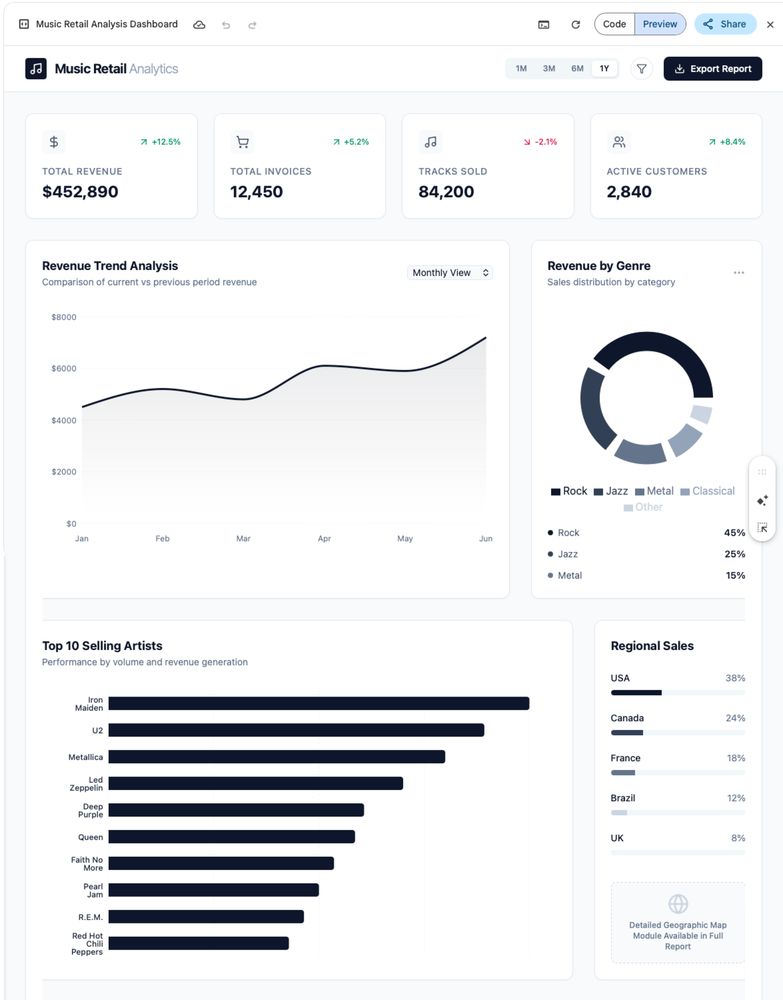

# Dashboard Mockup Prompt 

> [!Note]
>
> The template shows you how you can share information about your data, just enough to help the model create the mockup without exposing your actual data or needing to upload your data files for privacy.

# Prompt Template

**Role & Goal:** Act as an expert UI/UX designer and data visualization specialist. I need you to design a modern, intuitive, and visually striking dashboard mockup to be built in [Insert The tool e.g. Power BI] for a [insert industry or application purpose, e.g., financial forecasting, resource monitoring] application.

**Data Structure (Metadata Only):** I have a dataset I want to visualize. To protect privacy, I am only providing the structural schema and data types. Use this to determine the best chart types and layouts:

- **Entity 1:** [e.g., "Timestamp column spanning 24 months (Daily frequency)"]
- **Entity 2:** [e.g., "Categorical variable with 4 distinct groups (e.g., North, South, East, West)"]
- **Entity 3:** [e.g., "Continuous numerical variable representing volume, ranging from 0 to 10,000"]
- **Entity 4:** [e.g., "Boolean status flag (True/False)"]

**Key Performance Indicators (KPIs):** The primary users of this dashboard need to quickly understand the following:

1. [e.g., The overall trend of Entity 3 over time]
2. [e.g., A comparison of Entity 3 across the different categories in Entity 2]
3. [e.g., The current percentage of Entity 4 that is flagged 'True']

**Design Preferences:**

- **Vibe/Style:** [e.g., Dark mode, minimalist, high-contrast, corporate, futuristic]
- **Layout:** Please suggest a layout hierarchy (e.g., what goes in the top summary cards, what takes up the main central area, what goes in the sidebar).

**Deliverables Requested:**

1. **Wireframe Layout:** A text-based spatial map of the dashboard (Top, Middle-Left, Middle-Right, Bottom).
2. **Visualization Recommendations:** Tell me exactly what type of chart or UI element (e.g., sparkline, heat map, gauge, data table) to use for each KPI and *why* it fits the data structure.
3. **Color & Typography:** A suggested color palette (with hex codes) and font pairings that fit the requested style.
4. **Code Mockup:** Provide a skeleton code mockup using [insert preferred tech stack, e.g., React with Tailwind CSS, HTML/CSS, or Python/Dash] using dummy data (e.g., `Math.random()`) so I can see the structural layout in my browser.

----

## Example Usage 

**Role & Goal:** Act as an expert UI/UX designer and data visualization specialist. I need you to design a modern, intuitive, and visually striking dashboard mockup to be built in Power BI for a Music Retail Analysis application

**Data Structure (Metadata Only):** I have a dataset I want to visualize. To protect privacy, I am only providing the structural schema and data types. Use this to determine the best chart types and layouts:

- **INVOICE** :billing_address, billing_city, billing_country, billing_postal_code, billing_state, customer_id, invoice_date, invoice_id, total
- **INVOICE_LINE**: invoice_id, invoice_line_id, quantity, track_id, unit_price
- **TRACK**:Album_id, bytes, composer, genre_id, media_type_id, milliseconds, name, track_id, unit_price
- **GENRE**: genre_id, name
- **ALBUM**: album_id, artist_id, title
- **ARTIST**: artist_id, name
- **CUSTOMER**: address, city, company country, customer_id, email, fax, first_name, last_name, phone, postal_code, state_support_rep_id

**Key Performance Indicators (KPIs):** The primary users of this dashboard need to quickly understand the following:

1. Total revenue
2. Total invoices
3. Total tracks sold
4. Trend analysis
5. Revenue by Genre
6. Top 10 selling Artists 

**Design Preferences:**

- **Vibe/Style:** Corporate style, minimalistic 
- **Layout:** Please suggest a layout hierarchy (e.g., what goes in the top summary cards, what takes up the main central area, what goes in the sidebar).

**Deliverables Requested:**

1. **Mockup Design** 

### Example output using Gemini (Canvas)

### Example output using Claude (using Haiku)

