# PowerBI Desktop (Day 1)


[toc]

## Learning Objectives

By the end of Day 1, you will be able to:

- Understand the difference between Power BI Desktop and Power BI Service
- Navigate the Power BI Desktop interface confidently
- Import data from CSV files and create basic visualizations (column, bar, and line charts)
- Explain what a data model is and why it matters
- Use Power Query to clean and transform data (remove rows, change data types, split columns, handle errors)
- Create relationships between multiple tables
- Build interactive reports with slicers and filters

------

## Power BI Desktop vs Power BI Service

### What is Power BI Desktop?

Power BI Desktop is a **free Windows application** you install on your computer. It's the primary authoring tool for creating Power BI reports, and it works completely offline.

**Download**: https://powerbi.microsoft.com/desktop

### Desktop vs Service: Key Differences

| Feature               | Power BI Desktop              | Power BI Service (Web)                      |
| --------------------- | ----------------------------- | ------------------------------------------- |
| **Cost**              | Completely free               | Free tier with limitations; Pro for sharing |
| **Installation**      | Windows desktop app           | Web browser (no install)                    |
| **Working Mode**      | Offline, saved as .pbix files | Online, stored in cloud workspaces          |
| **Power Query**       | ✅ Full functionality          | ✅ Full functionality                        |
| **Visualizations**    | ✅ Full functionality          | ✅ Full functionality                        |
| **Data Modeling**     | ✅ Full functionality          | ✅ Full functionality                        |
| **Sharing Reports**   | Email .pbix files             | Publish and share via web links             |
| **Scheduled Refresh** | ❌ Manual only                 | ✅ Scheduled refresh (Pro/Premium)           |
| **Dashboards**        | ❌ Not available               | ✅ Available                                 |
| **Mobile Access**     | ❌ Windows only                | ✅ Access from any device                    |

> [!important] 
>
> **For this course, we use Power BI Desktop**. All the core skills you learn (data transformation, modeling, DAX, visualizations) work identically in both Desktop and Service. If you later get Power BI Pro, you can simply publish your .pbix files to the Service.

### What is a .pbix File?

Unlike the Service (which stores data models and reports separately), Power BI Desktop saves everything in a single file with the `.pbix` extension:

- Data model (tables, relationships)
- Power Query transformations
- DAX measures and calculations
- All report pages and visualizations
- Formatting and themes

Think of it like an Excel workbook - one file contains everything.

------

## Installing Power BI Desktop

### System Requirements

- Windows 10 or Windows 11
- .NET Framework 4.8 or later
- At least 4 GB RAM (8 GB recommended)
- 2.5 GB available disk space

### Installation Steps

1. Go to https://powerbi.microsoft.com/desktop
2. Click **Download Free**
3. Choose:
   - **Microsoft Store** (recommended - auto-updates)
   - **Download Center** (standalone .exe installer)
4. Run the installer and follow prompts
5. Launch Power BI Desktop from Start menu

> [!tip] 
>
> The Microsoft Store version automatically updates when new features are released. The standalone installer requires manual updates.

------

## Power BI Desktop Interface Tour

When you first open Power BI Desktop, you'll see three main views accessible from the left sidebar:

### Main Views (Left Sidebar Icons)

| Icon              | View               | Purpose                                            |
| ----------------- | ------------------ | -------------------------------------------------- |
| 📊 **Report View** | Report canvas      | Create visualizations and design report pages      |
| 📋 **Table View**  | Data grid          | View and verify loaded data (formerly "Data View") |
| 🔗 **Model View**  | Data model diagram | Create and manage table relationships              |

### Report View Components

When in Report view, you'll work with:

**Top Ribbon**

- **Home**: Common tasks (Get Data, Save, Publish)
- **Insert**: Add text boxes, images, shapes, buttons
- **Modeling**: Create measures, calculated columns, manage relationships
- **View**: Show/hide panes, gridlines, page navigation
- **Optimize**: Performance analyzer
- **Help**: Documentation and support

**Right Panes**

1. **Filters**: Page-level, visual-level, and report-level filters
2. **Visualizations**: Chart types and visual formatting options
3. **Data**: Fields from your data model

> [!note]
>
> You can show/hide any pane from the **View** tab. Common workflow: maximize canvas space by hiding Filters pane, show it only when needed.

### Understanding the Canvas

The white central area is your **report canvas** where you design pages:

- Each report can have multiple pages (tabs at bottom)
- Drag visuals to resize and position them
- Grid and snap-to-grid help with alignment

------

# Part 1: Creating Your First Report

## The Scenario

You've just joined a small real estate advisory firm as a junior data analyst. A senior partner is preparing a presentation for a client — an investment fund considering entering the New York City property market — and she needs a quick visual overview of recent sales activity.

She hands you a CSV file exported from the city's public property transaction records and says:

> *"I need to understand where the action is. Which boroughs and neighborhoods have the highest sale volumes? What types of buildings are selling? Are there any areas that look overpriced or undervalued compared to others? Just give me something I can look at."*

Your job: get this data into Power BI and build three exploratory charts that answer her questions. This is a first look — no cleaning required, no complex modeling. You're learning the tool and the workflow.

**What the data contains:**

| Column | What it means |
|---|---|
| `Area` | Borough (Manhattan, Brooklyn, Queens, Bronx, Staten Island) |
| `NEIGHBORHOOD` | Sub-area within the borough |
| `BUILDING CLASS CATEGORY` | Property type (co-op, condo, family home, commercial, etc.) |
| `SALE DATE` | Date of the transaction |
| `SALES PRICE` | Sale price in USD |
| `LAND SQUARE FEET` / `GROSS SQUARE FEET` | Property size |
| `YEAR BUILT` | Age of the building |

**Questions this data can answer:**
- Which borough has the highest total sales volume?
- Which neighborhoods have the most transactions?
- What property types dominate sales in each area?
- How are sale prices distributed — are there extreme outliers?

---

## Step 1: Getting the Data

1. **Open Power BI Desktop**
2. **Get Data**:
   - Click **Home** tab → **Get Data** → **Text/CSV**
   - Navigate to and select `ny_property_sales.csv`
   - Click **Open**
3. **Preview Window Appears**:
   - You'll see a preview of the data
   - Power BI auto-detects data types
   - For now, click **Load** to import the data as-is

> [!note]
>
> When you click **Load**, Power BI loads the data directly. If you click **Transform Data** instead, it opens Power Query Editor for cleaning (we'll do this in Part 2).

## Step 2: Verify Data Loaded

1. Click the **Table View** icon (left sidebar, middle icon)
2. You should see the `ny_property_sales` table
3. Review the columns and data types
4. Click back to **Report View** (top icon in left sidebar)

## Step 3: Creating Visualizations

Now let's create three charts on your report canvas.

### Chart 1: Total Sales By Area (Stacked Column Chart)

1. Click on a blank area of the canvas (to deselect any existing visual)
2. From the **Visualizations** pane (right side), click the **Stacked Column Chart** icon
3. A blank chart appears on the canvas
4. From the **Data** pane (far right), find the `ny_property_sales` table and:
   - Drag `Area` to the **X-axis** well
   - Drag `SALES PRICE` to the **Y-axis** well (it automatically sums)
5. Resize and position the chart

**Formatting (Optional)**:

- Click the chart to select it
- In **Visualizations** pane, click the **Format visual** tab (paint roller icon)
- Expand **Visual** → **Columns** → **Colors** to change bar color
- Expand **General** → **Title** to rename the chart (e.g., "Total Sales by Area")

### Chart 2: Top 10 Building Class Category by Sales (Stacked Bar Chart)

1. Click blank area of canvas
2. Select **Stacked Bar Chart** from Visualizations pane
3. Add fields:
   - `BUILDING CLASS CATEGORY` → **Y-axis**
   - `SALES PRICE` → **X-axis** (auto-sums)
4. **Add a Top N Filter**:
   - Select the bar chart
   - In **Filters** pane, under **Filters on this visual**, find `BUILDING CLASS CATEGORY`
   - Change filter type to **Top N**
   - Set to show **Top 10**
   - Drag `SALES PRICE` to the **By value** field
   - Click **Apply filter**
5. Format as desired (colors, title)

### Chart 3: Sales by Month (Line Chart)

1. Click blank area of canvas
2. Select **Line Chart** from Visualizations pane
3. Add fields:
   - `SALE DATE` → **X-axis**
   - Power BI creates a date hierarchy (Year > Quarter > Month > Day)
   - Click the dropdown on `SALE DATE` in the X-axis well and select **Month** (remove hierarchy)
   - `SALES PRICE` → **Y-axis**
4. Format as desired

## Step 4: Save Your Work

1. **File** → **Save**
2. Choose a location and name your file (e.g., `NY_Property_Sales.pbix`)
3. Click **Save**

> [!tip]
>
> Unlike the Service (which auto-saves), Desktop requires manual saves. Save frequently with **Ctrl+S**.

## Step 5: Test Interactivity

1. Click on a bar in one of your charts
2. Notice the other charts filter/highlight based on your selection
3. This is **cross-filtering** - it happens automatically in Power BI
4. Click the bar again (or click empty space) to deselect

------

# Part 2: Building a Sales Analytics Dashboard

## The Scenario

You're now a data analyst at a mid-size retail company that operates physical stores across multiple Indian cities. The company sells across several product categories and has been running various promotions alongside its standard pricing.

The VP of Sales walks in on Monday morning and drops three years of transaction data on your desk:

> *"We've been collecting sales data since 2017 but nobody has actually looked at it properly. I need to know: are our promotions actually working? Which product categories are driving revenue? Are some stores consistently underperforming? And why does delivery time vary so much — is it hurting sales? I need answers before the quarterly review."*

There's a catch: the 2017 data is a mess — formatting inconsistencies, wrong data types, and some columns that were clearly added by someone who wasn't thinking about downstream analysis. The 2018 and 2019 files are cleaner. Your first job is to fix the data, then combine all three years and build a dashboard that answers the VP's questions.

**What the data contains:**

| Column | What it means |
|---|---|
| `order_id` | Unique transaction identifier |
| `product_id` | Product reference |
| `store_id` | Which store made the sale |
| `order_date` | Date of purchase |
| `sales` | Units sold |
| `revenue` | Revenue for the transaction (USD) |
| `promo_type_1` / `promo_bin_1` | Primary promotion type and discount bucket |
| `promo_type_2` / `promo_bin_2` | Secondary promotion (if any) |
| `promo_discount_2` | Discount percentage for the second promotion |
| `delivery_date_format1/2` | Delivery date (stored inconsistently — you'll need to fix this) |

The **producthierarchy.csv** adds category, sub-category, and hierarchy labels to each product. The **store_cities.csv** adds city and state to each store.

**Questions this data can answer (once it's clean):**
- Which product categories generate the most revenue?
- Do promotions increase sales volume — or just discount existing sales?
- Which stores and cities are over/underperforming?
- Is delivery speed correlated with order volume?
- How did revenue trend month-over-month across 2017–2019?

**Why the cleaning matters:** The VP asked these questions — but the raw data can't answer them yet. Power Query is the bridge between messy source data and meaningful analysis. Everything you do in this part (fixing types, removing junk rows, combining files) is what a real analyst does before a single chart gets built.

## The Datasets

| File | Contents |
|---|---|
| `sales2017_raw.csv` | 2017 transactions — messy, needs cleaning in Power Query |
| `sales2018.csv` | 2018 transactions — clean |
| `sales2019.csv` | 2019 transactions — clean |
| `producthierarchy.csv` | Product dimension: category, sub-category, hierarchy labels |
| `store_cities.csv` | Store dimension: city and state for each store |

---

## Step 1: Import the Data Files

### Import sales2017_raw.csv

1. **Home** → **Get Data** → **Text/CSV**

2. Select `sales2017_raw.csv`

3. In the preview window, click **Transform Data** (NOT Load)

   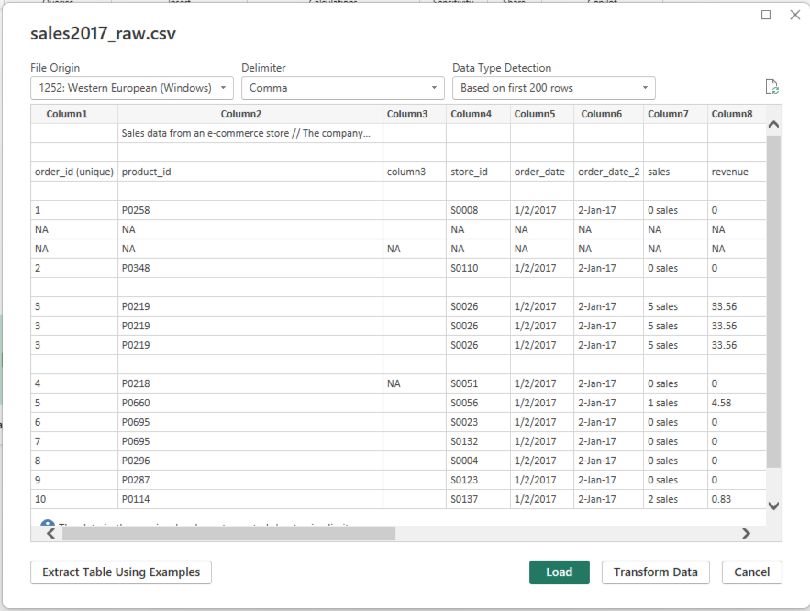

   - This opens **Power Query Editor**

> [!important]
>
> Clicking **Transform Data** opens Power Query Editor where you can clean data before loading it into the model. This is where we'll spend most of our time.

### Power Query Editor Interface

When Power Query opens, you'll see:

**Left Pane**: Queries (list of tables you're working with) 

**Center**: Data preview with column headers

 **Right Pane**:

- **Query Settings**: Name of current query and Applied Steps
- **Properties**: Query-level settings
- __Applied Steps__:  These are a recorded, sequential list of all data transformations applied to a data source

**Ribbon Tabs**:

- **Home**: Common transformations (Remove rows, Split column, Data type)
- **Transform**: Column operations (Replace values, Format text, Extract)
- **Add Column**: Create new columns (Custom, Conditional, Index)
- **View**: Show/hide panes, advanced options

### Understanding Applied Steps

In the **Query Settings** pane (right), you'll see **Applied Steps**:

```
Source
Promoted Headers
Changed Type
```

Each step represents a transformation. You can:

- Click a step to see the result at that point
- Delete a step (X icon)
- Reorder steps (drag and drop)
- Edit a step (gear icon)

> [!warning]
>
> Be careful deleting or reordering steps - later steps may depend on earlier ones. Power BI will warn you if there's a dependency issue.

## Step 2: Clean the Sales Data

Let's transform this messy data step by step.

### A. Enable Data Profiling

1. In Power Query, go to **View** tab

   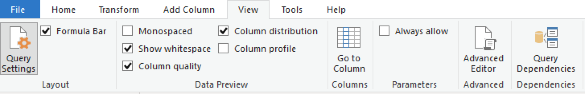

2. Check:
   - ☑️ **Column quality** (shows valid/error/empty percentages)
   - ☑️ **Column distribution** (shows value frequency)
   - ☑️ **Show whitespace** 

3. At bottom, change "Column profiling based on" from **Top 1000 rows** → **Entire dataset**

   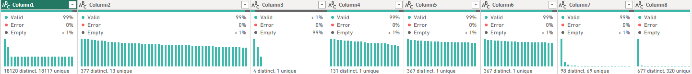

This helps you spot data quality issues at a glance.

### B. Remove Empty Rows

First step we need to skip the first two rows:

1. __Home__ tab → __Remove Rows__ → __Remove Top Rows__ → Number of Rows = 2
2. Look at the data - you'll see rows with all blank values
   1. **Home** tab → **Remove Rows** → **Remove Blank Rows**
   2. Notice a new step appears in Applied Steps: "Removed Blank Rows"

### C. Promote First Row to Headers

The first row contains column names, not data:

1. **Home** tab → **Use First Row as Headers**
2. Column names update
3. A step "Promoted Headers" is created

### D. Remove NAs from product_id

1. filter the column to remove rows that are `NA` or `(blank)` by unchecking them. Then click **Ok**.

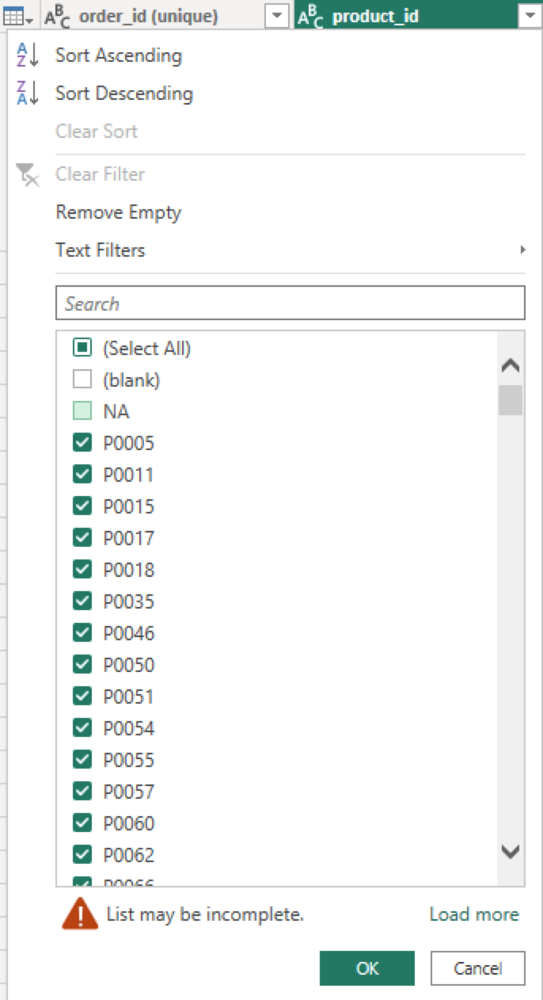

### E. Remove unnecessary columns 

Looking at column3 profile it show 99% being empty. We can safely remove this columns using:

Click on __column3__, then **Home** tab → **Remove Columns** dropdown

### F. Change Data Types

Power BI auto-detects types, but let's verify:

1. Look at the column headers - the icon shows the detected type:
   - `ABC` = Text
   - `123` = Whole Number
   - `1.2` = Decimal
   - `📅` = Date
2. To change a data type:
   - Click the icon next to the column name
   - OR: Right-click column → **Change Type**
   - OR: **Transform** tab → **Data Type** dropdown

**For our sales data, ensure:**

- `order_date`  and `order_date2`→ **Date**

  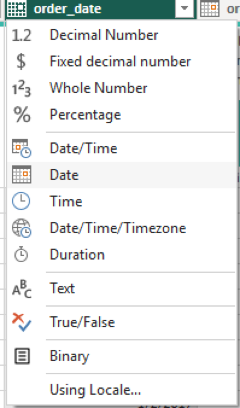

- `delivery_date_format1` → **Date**

- `revenue` → **Decimal Number** or **Fixed Decimal Number**

- `stock` → **Whole Number**

- `order_id` → **Text** (even if numeric - these are IDs, not measures)

> [!tip] 
>
> **Why keep IDs as Text?** Order IDs like "001" and "1" are different. As text, they're preserved. As numbers, they'd both become 1.

### E. Handle Locale Issues

In the data view, the columns `delivery_date_format1` and `delivery_date_format2` are the same but uses different date formats. The first uses a standard USA date format (month/day/year) while the second uses a non standard date format (for USA). If you attempt to change the format on the ``delivery_date_format2`` to date, some dates will error out. In order to achieve this successfully you will need to change the __locale__

From the `delivery_date_format2` click on __Using Locale…__

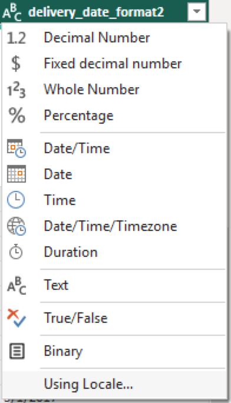

Then change type of locale and click __OK__

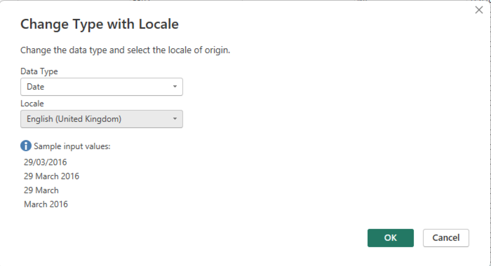

Validate that you have no errors in any of the values

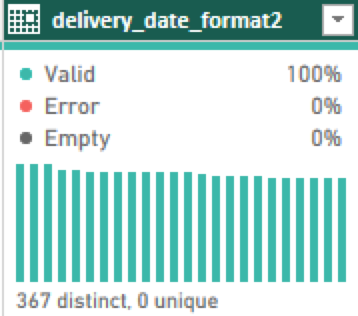

### F. Change Price type 

If you try to change Price from Text to Fixed decimal you will see few errors. 

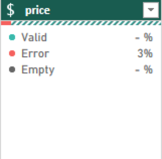

This is due to some NA values. Here is how you can clean that up:

1. Filter out NA values then click OK

   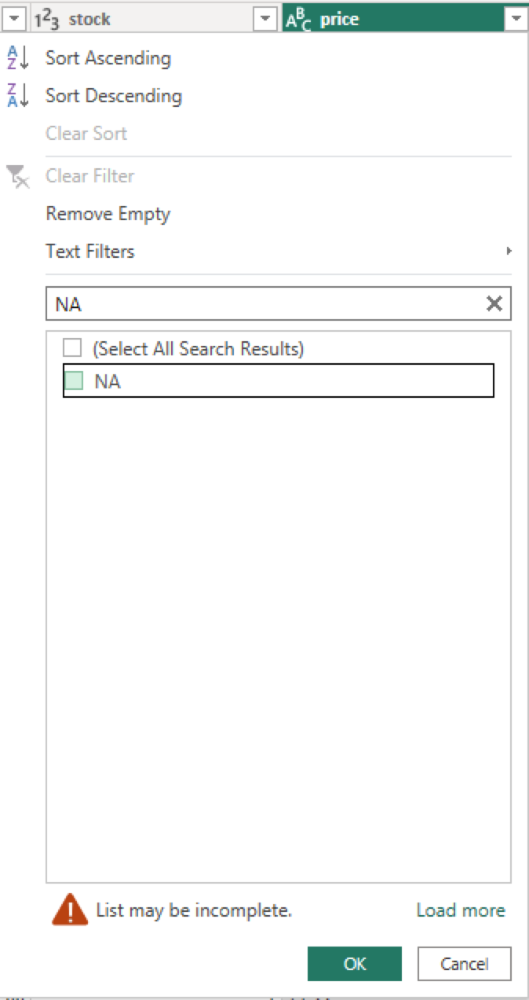

2. Change the data type from Text to Fixed decimal. 

   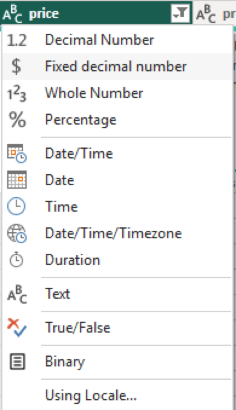

   And make sure there are no errors

   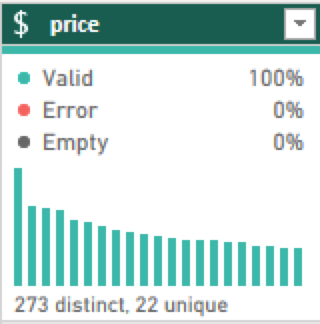

### G. Promo_bin_1 values 

In `promo_bin_1` let’s replace `verylow` with `very low`

1. Click on `promo_bin_1`
2. **Home** → **Replace Values** →`verylow` to `very low` then click OK

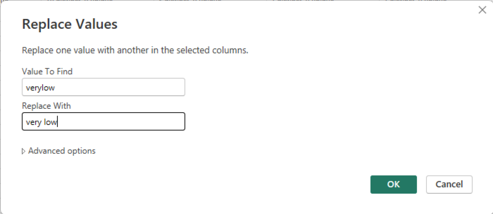


### H. Clean up sales column

1. Remove the word `sales` using replace 
   1. **Home** → **Replace Values** →`sales` with nothing (blank)
   2. Update data type to Decimal number

### I. Remove duplicates

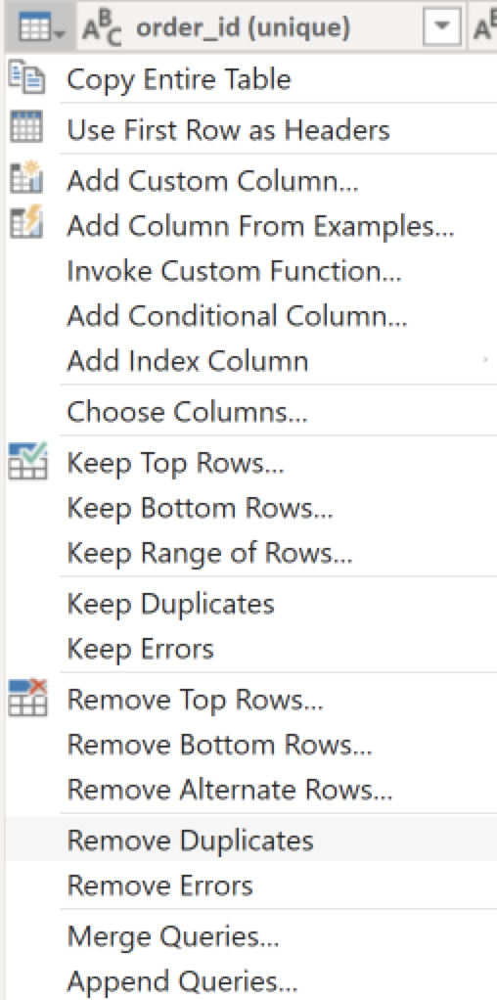

## Step 3: Import Stores and Products Tables

### Import stores_cities.csv

1. In Power Query Editor: **Home** → **New Source** → **Text/CSV**
2. Select `store_cities.csv`
3. Click **OK** (opens in Power Query)

### Import producthierarchy.csv

1. **Home** → **New Source** → **Text/CSV**
2. Select `producthierarchy.csv`
3. Click **OK** (opens in Power Query)


## Clean  store_cities.csv 

1. Rename the sources by double clicking their names

   1. `store_cities` to `stores`

   2. `sales2017_raw` to `sales2017`

      

   > [!note]
   >
   > Later you will connect the two dataset through the `store_id` column present in both.

2. We need to clean the dataset first:

   1. Make the first row as headers. You can do this by selecting : **Home** → __Use first row as headers__

3. For the `store_size` column we need to extract the measures (values). We can do this using __Extract__

   1. Click on `store_size`. 
   2. From the __Transform__ menu select __Extract__, then __Text Before Delimiter__
   3. For the __Delimiter__ you can enter a **space** then click OK.
   4. Rename the column rom `store_size` to `store size`.  One way to accomplish this is by double clicking the column name.
   5. Change the data type from `Text` to `Whole Number`

4. You will need to split **state**, **state abbreviation**, and **city** in the `state - state abr - city` column.

   1. Select the `state - state abr - city` column. From the __Home__ menu select __Split column__, select __By delimiter__
   2. In the __Separator__ drop down, select `--Custom--`, and type a hyphen `-` then click OK.
      1. This should split the column into three columns. If you did not get three columns, click on edit option to edit the step and check that __Each occurrence of the delimiter__ option is selected, and __Number of columns to split into__ it set to 3 under the Advanced options.
   3. Finally, rename the columns: `state abr`, `state`, and `city`

5. Finally, split the last column `lat/long`

   1. Similar to prior step, select the `lat/long` column, select __Split column__, select `--Custom--` separator, then type ` /` (space then `/` then space). Click OK.
   2. Rename the columns to `lat` and `long`

6. Go to the __Transform__ menu, and try the __Detect data type__ for the remaining columns. 

   1. When we did split columns, some values had leading white spaces that are hard to see. 

      1. For `state` column, you can right click, go down to select __Transform __, then select  __Trim__

         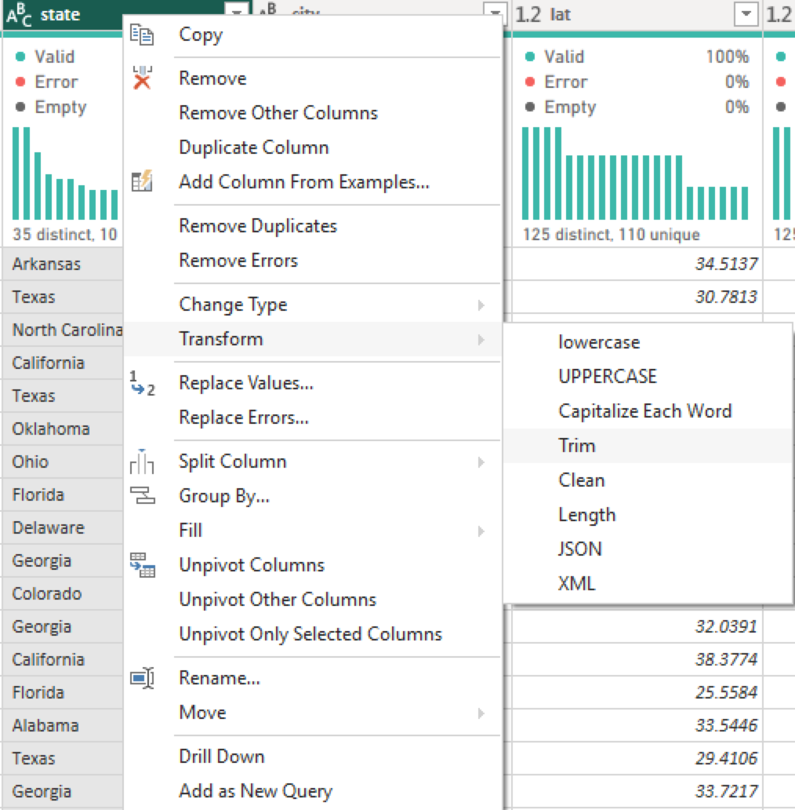

      2. Do the same for the `city` column

## Clean  producthierarchy.csv 

The dataset requires some cleaning and preparation as well. 

Start by renaming the dataset to `products`.

1. Use the first row as header 

2. The `product (brand)` column contains some unwanted characters including special control characters like tab. This can be cleaned using the __clean__ tool.

   1. Select `product (brand)` column, right-click, select __Transform __, then select __Clean__
   2. Select `product (brand)` column, right-click, select __Transform __, then select  __Capitalize Each Word__

3. The last column `category || sub_category` needs to be split into two columns `category` and `sub_category`

   1. You can split using ` || ` for a clean split (space `||` then space)

4. We can do a split to the `length x depth x width (in cm)` column into three columns: `length`, `depth`, `width`

   1. You can split using ` x ` (space `x` space)
   2. Convert from CM to Inches (1 cm approximately equals 0.394 inches)
      1. Select `length` column. From the __Add column__ menu, select __Standard__, then select __Multiply__, and enter `0.394` then click OK.
      2. Do the same for `depth` and `width` columns
      3. Rename the newly created columns to indicate they are inches, `length (inches)`, `depth (inches)`, and `width (inches)`

5. From __Transform__ select __Detect Data Type__ to change the data types of the columns. Inspect the results. 

6. __Challenge__

   1. The `product (brand)` column consists of the product followed by the brand in parenthesis for example `Serum (Livon)`
   2. Split the column into two: `product` and `brand` columns

   > [!tip]
   > **Hint**: Use Split Column by Delimiter with `(` as the delimiter. After splitting, you'll need to remove the trailing `)` from the brand column using **Replace** Values. 

## Step 4: Load Data into Power BI Desktop

1. In Power Query Editor, click **Home** → **Close & Apply**
2. Power BI loads all three queries into your data model
3. You're back in Report View

> [!tip]
>
> If you need to edit queries later: **Home** tab → **Transform Data** reopens Power Query Editor.

## Step 5: Create Relationships Between Tables

Now we need to connect the three tables.

### Switch to Model View

1. Click the **Model View** icon (left sidebar, bottom icon)
2. You'll see three tables: `sales`, `stores`, `products`
3. Power BI may have auto-created relationships - we'll verify

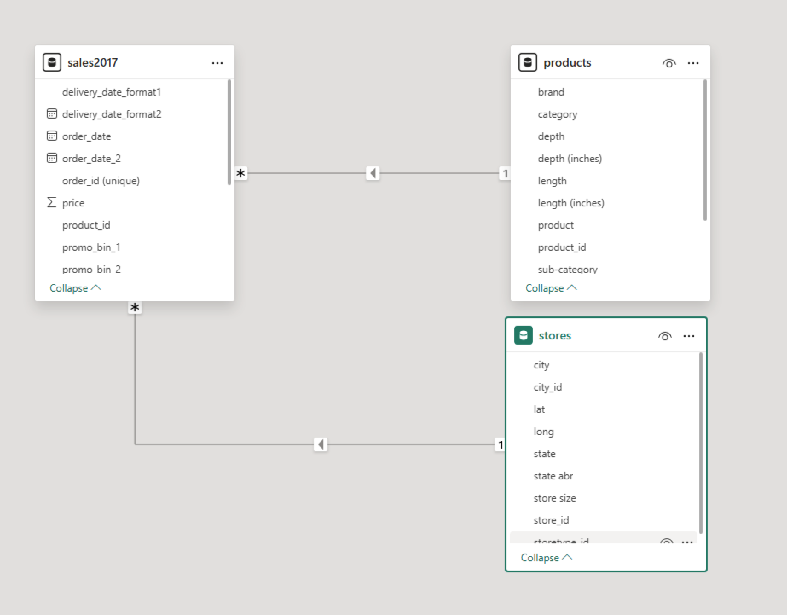

You inspect the relationship, for example if you click on the lines connecting two tables you will see its properties including which column being used to join:

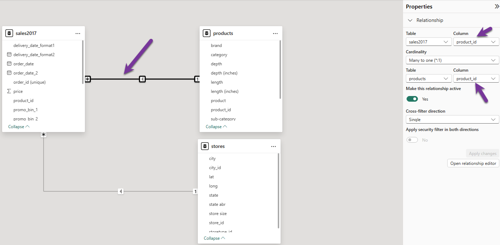

You should always verify this.

### Understanding Relationships

Relationships connect tables through common columns (keys):

- **One-to-Many (1:\*)**: One product can appear in many sales (most common)
- **Many-to-One (\*:1)**: Many sales can reference one product (same as above, different perspective)
- **One-to-One (1:1)**: Rare in real-world data
- **Many-to-Many (\*:\*)**: Avoid if possible; can cause unexpected behavior

**Relationship Line Indicators:**

- `1` on one end, `*` on the other = One-to-Many
- Solid line = Active relationship
- Dashed line = Inactive relationship

### Optional: Create sales → products Relationship

You can recreate the relationships. Delete the existing relationships and do the following:

1. Drag `product_id` from the `sales` table onto `product_id` in the `products` table

2. A line appears connecting them

   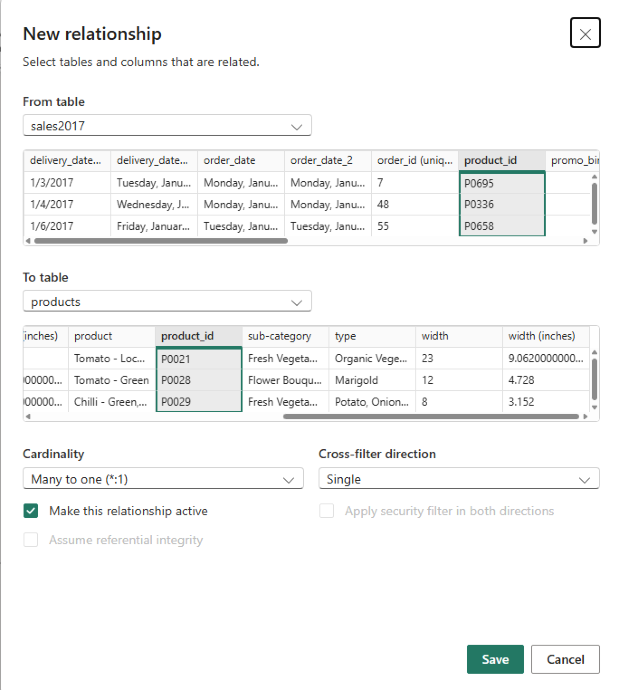

3. Double-click the line to verify:
   - **Cardinality**: Many to One (*:1) - many sales rows can reference one product
   - **Cross filter direction**: Single (from products to sales)
   - **Make this relationship active**: ☑️ Checked

4. Click **Save**

### Create sales → stores Relationship

1. Drag `store_id` from `sales` to `store_id` in `stores`
2. Verify the relationship settings (should be Many-to-One)

### Verify Relationships

Your model should now look like a **star schema** (not exactly):

- **Fact table** (center): `sales` (transactional data)
- **Dimension tables** (around it): `products`, `stores` (lookup/descriptive data)

> [!important]
>
> **Why relationships matter**: Without relationships, you can't create charts like "Sales by Product Category" because Power BI doesn't know how to link sales data to product data.

------

## Step 6: Build Visualizations

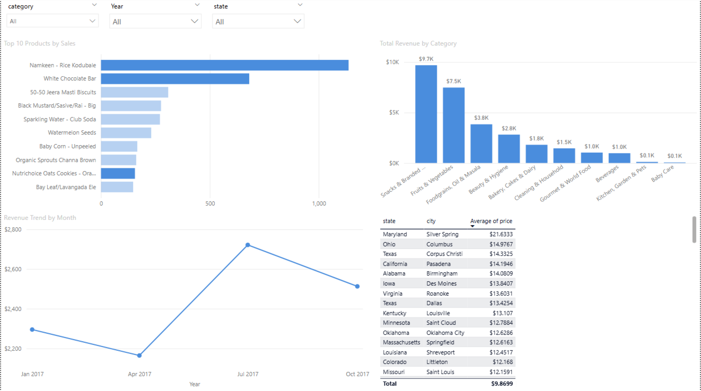

Now that data is clean and related, let's create meaningful visuals.

### Chart 1: Total Revenue by Category (Clustered Column Chart)

1. Switch to **Report View** (top icon in left sidebar)
2. Click blank canvas area
3. Select **Clustered Column Chart** from Visualizations pane
4. Add fields:
   - From `products` table: `category` → **X-axis**
   - From `sales` table: `revenue` → **Y-axis**
5. Power BI automatically sums revenue by category (because of the relationship!)

**Format**:

- Rename title: "Total Revenue by Category"
- Change bar colors if desired
- Add data labels: **Format visual** → **Visual** → **Data labels** → On

### Chart 2: Revenue Over Time (Line Chart)

1. Select **Line Chart**

2. Add fields:
   - `order_date` → **X-axis** (from `sales` table)
   - Expand the date hierarchy and keep only **Month**
   - `revenue` → **Y-axis**
   
3. Format:
   - Title: "Revenue Trend by Month"
   
   - Enable markers: **Format visual** → **Visual** → **Markers** → On
   
     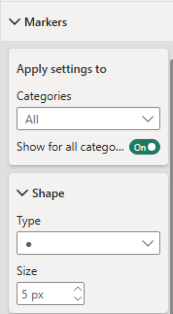

### Chart 3: Top 10 Products by Sales (Stacked Bar Chart)

1. Select **Stacked Bar Chart**

2. Add fields:
   - From `products`: `product_name` → **Y-axis**
   - From `sales`: `revenue` → **X-axis**

3. Add Top N Filter:
   - In **Filters** pane → **Filters on this visual**

   - Find `product_name`

   - Filter type: **Top N**

     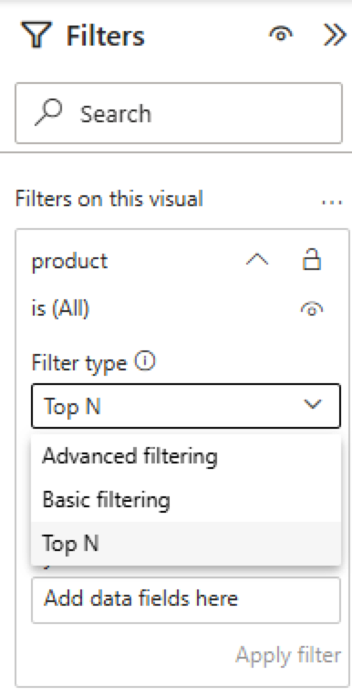

   - Show **Top 10**

   - By value: drag `sales` field here

   - Apply filter

4. Format as desired

5. Rename to ` Top 10 Products by Sales`

### Chart 4: Average Price by Store Location (Table Visual)

1. Select **Table** visual

2. Add fields from `stores` table:
   - `city`
   - `state`

3. Add field from `sales` table:
   - `price` (automatically sums)
   - Change it to `average`

4. Sort by revenue (descending): Click the `revenue` column header

   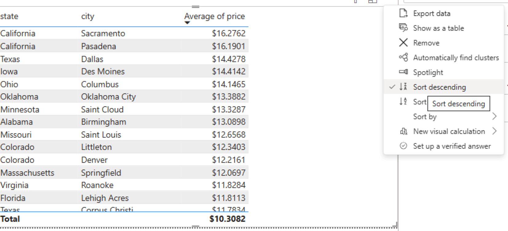

> [!Note]
>
> Answer the following questions:
>
> 1. **What is the total revenue for Bakery, Cakes, & Dairy**
> 2. **How many sales has the product "Namkeen - Rice Kodubale (Sln )"?**
> 3. **What is the average price in Dallas?**


Change the formatting:

From __View__ you can select one of the exiting templates

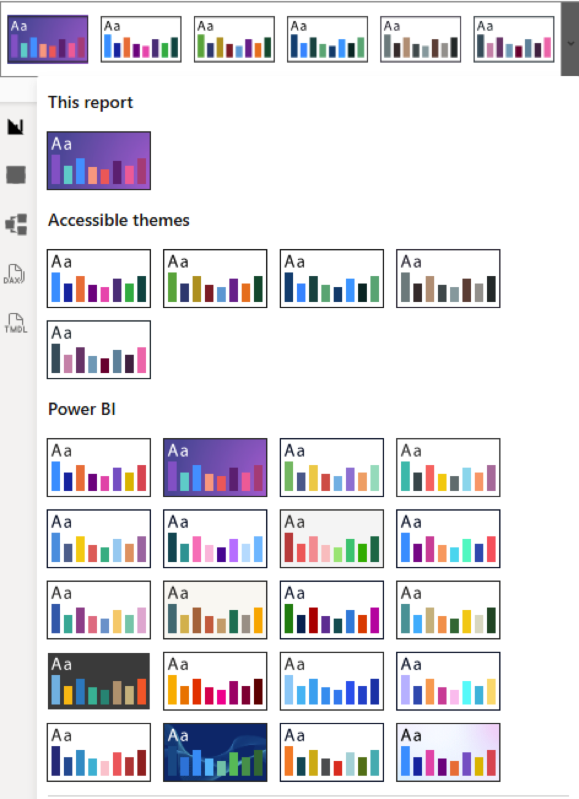

------

## Step 7: Add Slicers for Interactivity


**Slicers** are visual filters that let users interact with the report.

### Add a Category Slicer

1. Click blank area of canvas

2. Select **Slicer** from Visualizations pane

3. From `products` table, drag `category` to the **Field** well

4. Position at top-left of report

5. Change to Dropdown 

   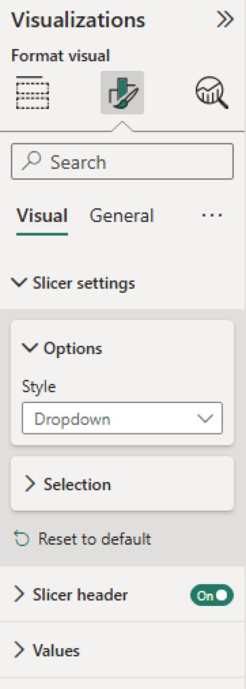

6. Test: Click "Beverages" → all visuals update to show only beverages data

7. You can change the font size if you want to make it smaller 

   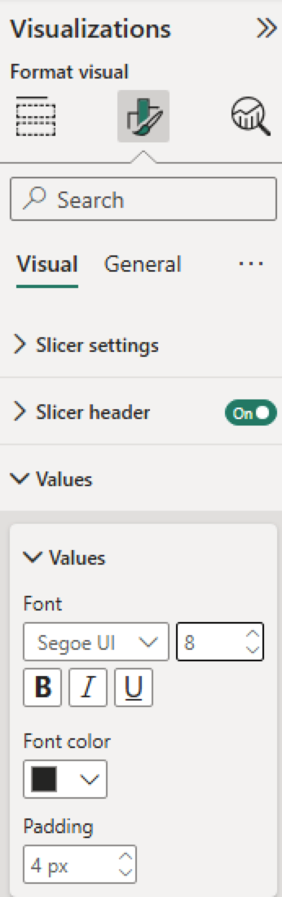

### Add a Year Slicer

1. Add another **Slicer**
2. Drag `order_date` from `sales` to Field well
3. Expand the hierarchy and keep only **Year**
4. Change slicer style to **Dropdown**
5. Position next to category slicer

### Add a Store State Slicer

1. Add another **Slicer**
2. From `stores`, drag `state` to Field well
3. Keep as list or change to **dropdown** style and place next to year slicer

------

## Step 8: Formatting and Polish

### Align Visuals

1. Select multiple visuals: Hold **Ctrl** and click each
2. **Format** tab → **Align** → Choose alignment option
   - **Align Left**: Line up left edges
   - **Distribute Horizontally**: Space evenly

### Add a Title

1. **Insert** tab → **Text box**

2. Type: "Sales Data Analysis"

3. Format (increase font size, bold, center align)

4. Position at top of page

   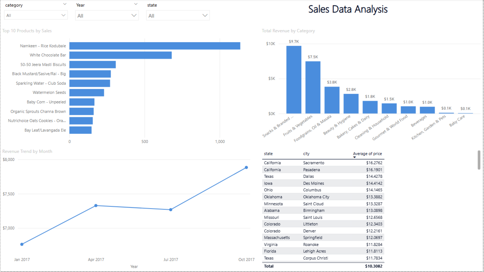


------

## Step 9: Save Your Work

1. **File** → **Save As**
2. Name: `Sales_Data_Analysis.pbix`
3. Save to your preferred location

------

## Step 10: Appending Additional Data

### Add a Page

1. At the bottom, click **+** to add a new page
2. Name it (right-click tab → Rename)
3. Build additional visuals on page 2

### Load the Datasets 

1. Click the __Get data__ option and select Text/CSV. Load both `sales2018.csv` and `sales_2019.csv` datasets (one at a time)

2. For the two datasets, make the first row as header.

   1. Both `sales2018` and `sales2019`, have similar columns to  `sales 2017` and can be stacked into one (one on top of the other). Stacking (or appending as called in Power BI) allows us to treat the multiple datasets as one.

   2. Delete the `delivery_date_format2` column from both datasets 

   3. For `sales2019`, change data profiling to include entire data set (from the bottom)

      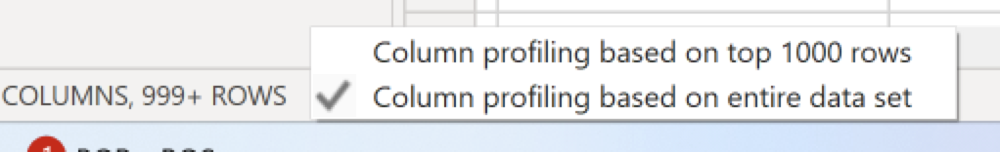

   4. Notice Price has some errors when we expanded the profiling. Select __Remove Errors__

      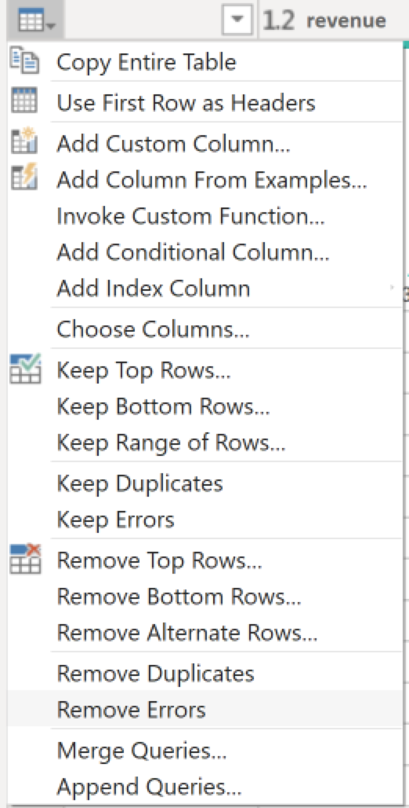

   5. From the __Home__ menu,  click __Append queries__ which gives us two options (Append queries and Append queries as new)

> [!Tip]
>
> **Append Queries** in Power BI combines rows from two or more tables with similar structures into an existing table, while **Append Queries as New** creates a distinct, separate table for the combined data. Append Queries (inline) saves memory by reducing table count, whereas Append Queries as New preserves original tables for separate use. 

3. Click __Append queries as new__, and select `sales2018` as the first table, and `sales2019` as the second table. Then click OK.

   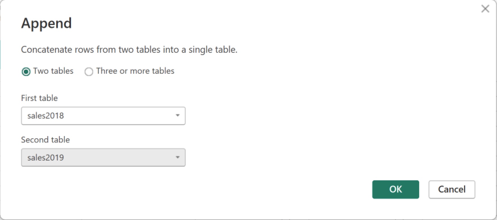

4. You may see a message on data privacy, just click __Continue__ 

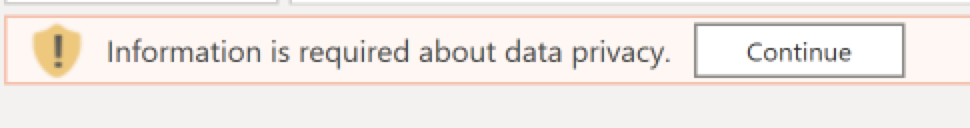

On the next screen make sure  __Ignore Privacy Levels checks for this document__ is __unchecked__. In the the drop downs below, select __Organizational__, then click __Save__

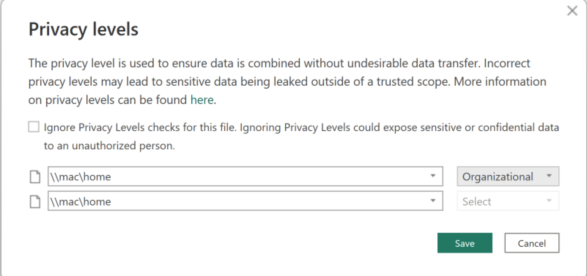

5. Double click the newly created data set labelled  `Append` and rename it to `sales`.

6. If any of the columns have errors, you can use the __Remove Errors__ option again . This is a good step to ensure everything is clean.

7. The `price` column has several `NA` values. WE can filter this out, by unselecting `NA` values as we did in an earlier step for `sales 2017`. 

8. From the __Transform__ menu, click __Detect data type__ to allow Power Query to help us auto detect the types for the remaining columns. 

   1. Update `Revenue` and `Price` to be **Fixed Decimal**. You may get a window like this:

      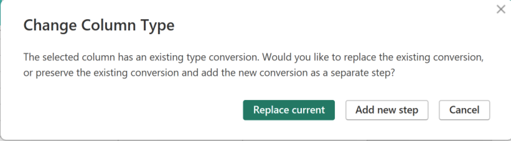

      Select Replace current. 

9. Now, let’s combine `sales` dataset with `sales 2017` dataset. 
   1. First, Delete the `delivery_date_format2` column  from the `sales 2017` data set

   2. Select the `sales` dataset which already combines `sales2018` and `sales2019`.

   3. Click  __Append queries__ select __Append queries__

   4. Select `sales 2017` as the Table to append. Then click OK.


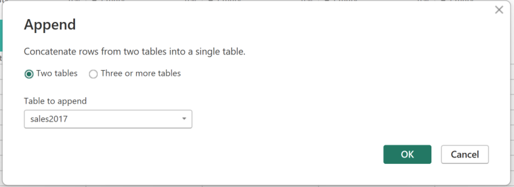

10. Let’s now organize and group/manage our queries better. We don’t need `sales 2017`, `sales2018`, and `sales2019` any more since they are all now combined into the `sales` dataset. 

​	In the Queries panel, right click anywhere and select __New group__ option. 

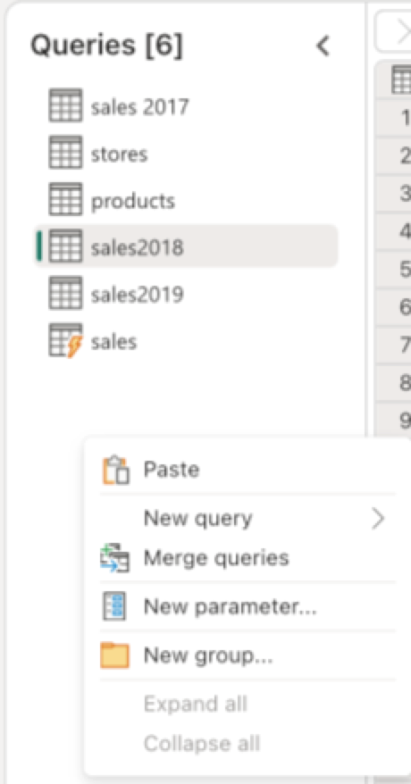

​	Name the group __Helper tables__

​	You can drag and drop the three tables we don’t need into the **Helper tables** group. Alternatively, you can right click and select __Move to group__, then 	select __Helper tables__

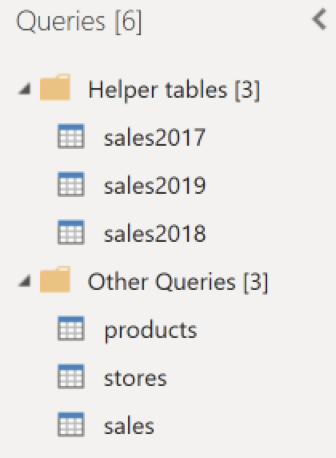


11. Click Close & Apply. 
12. Switch to the Model View. To make the view cleaner to the user, so they do not have to see all the tables when creating reports, you can make them hidden from view. Also, update the model to reflect what you see below:

If you see connections to the `sales2017`, `sales2018`, and `sales2019`, you can keep them or delete them as shown

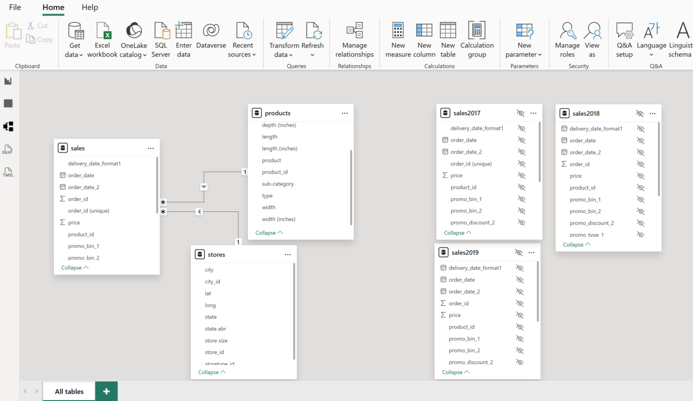

Notice from the screen shot three tables are hidden (`sales 2017`, `sales2018`, `sales2019`), and three are visible. I updated the relationship to be using the new `sales` table which combines all three years. 

----

## Step 11: Visualizations and Drilling

In the first page, notice the __Year __ selector wont work anymore since it used to point top `sales2017`. You can replace it to use the `sales` dataset.

For now, let’’s focus on creating a new dashboard. In the new page create the following:

#### **Sum of revenue by Category** 

**Stacked column bar**

1. X-axis: `category` 
2. Y-axis: `Sum of Revenue `
3. Format Visual
   1. Data labels turned on
      1. Background turned on
   2. For both X-axis and Y-axis turn off the Title option 

#### **Sum of revenue by Year**

**Line chart**

1. X-axis: `order_date` which is a date hierarchy consisting of year, quarter, month, and day
2. Y-axis: `Sum of Revenue`
3. Drill to the month level  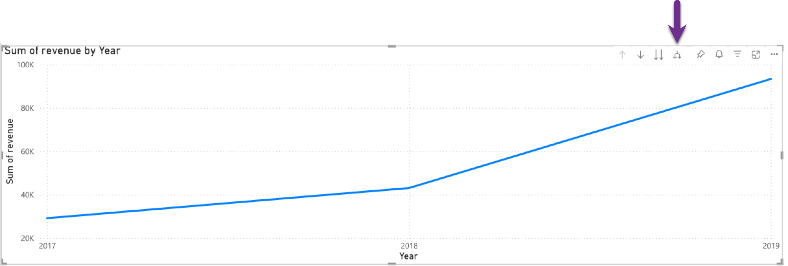

 Notice the icon highlighted, if you click this it would drill down from Year to Quarter, if you click again it would further drill down to Month, and again to Date. This allows you to drill within the Date hierarchy (drilling down, and drilling up)

 Keep it at Year, Quarter, and Month level as shown:

   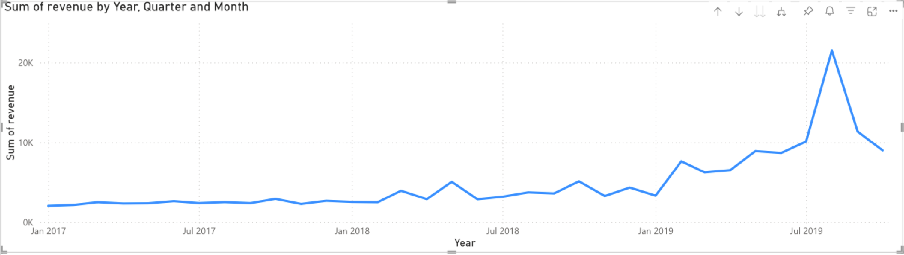

You can create similar drill hierarchy to the __Sum of revenue by category__ chart:

Drag `sub_category` and place it inside the X-axis right underneath  `category` as shown:

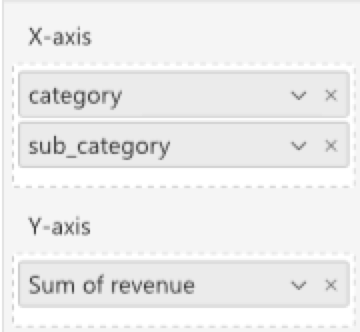

Notice the chart will be updated to reflect an ability to drill up and down the hierarchy 

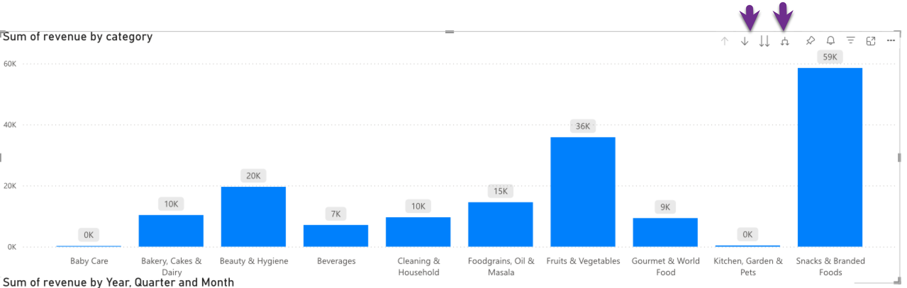

You can click on a bar and then right-click, select drill down. 

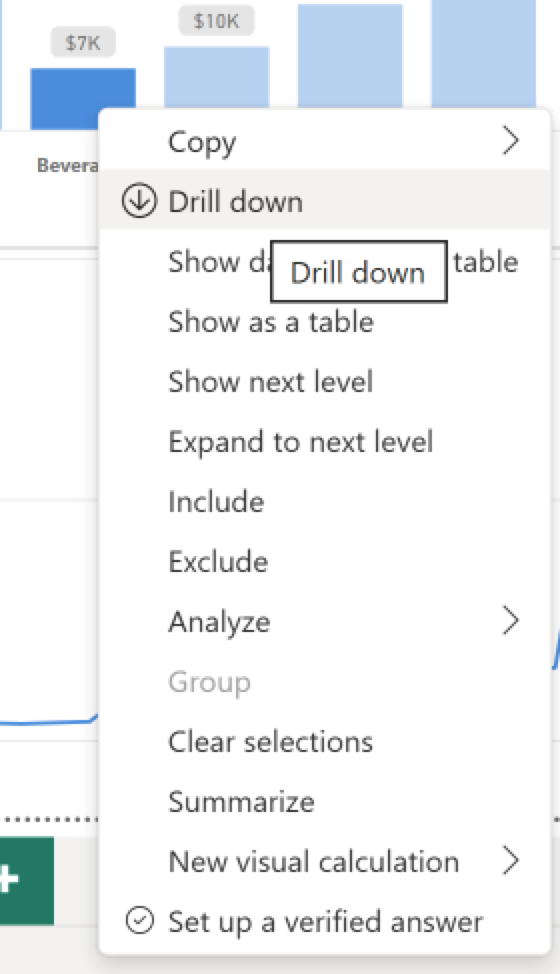

For example, Select `Beverages`, right click, select Drill down. You should see the following:

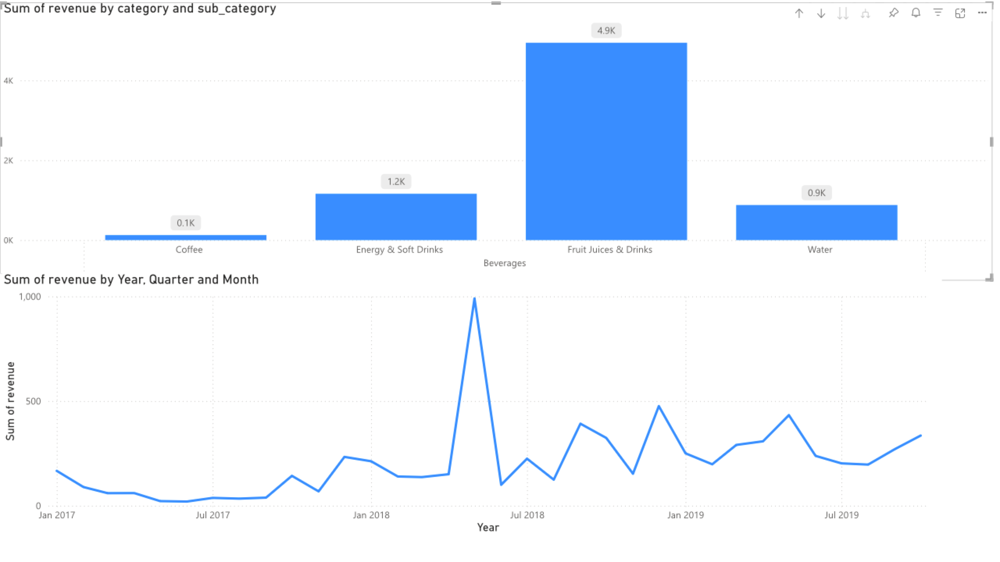

For the line chart, Let’s modify the line chart to include `Sum of sales` on the __Secondary y-axis__

1. Drag `sales` to the __Secondary y-axis__

   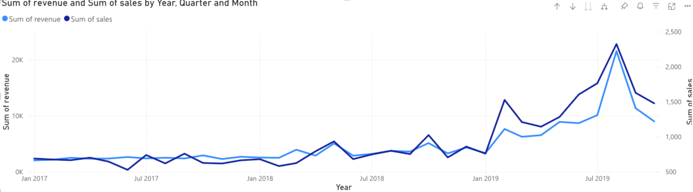

2. In the **Format Visual** panel, from the __Visual__ tab, scroll down and you will see __Zoom slider__ option. Turn that on. 

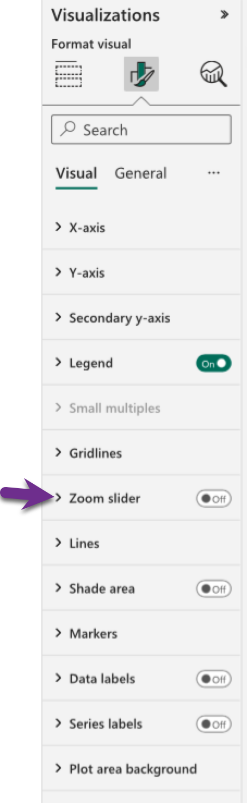

This will create two sliders: one for the y-axis and another for the x-axis. Turn the Y-axis off and just keep the X-axis turned on. Lastly click __Save__ to save the visualization as `Sales Data Analysis Part 2`

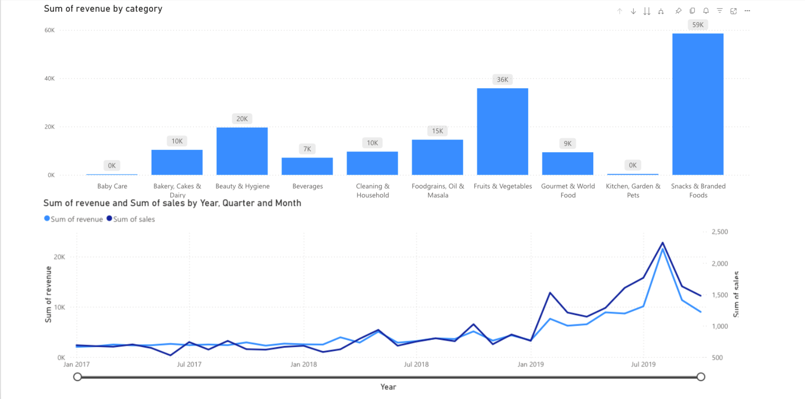


## Challenge

You've spent the day building Power BI skills step by step. Now put them together independently.

> **Open the mockup:** [`challenge-mockup.html`](../challenge-mockup.html) — view it in your browser as your target reference.

### Part A — Fix Page 1 (10 min)

The screenshot below shows what Page 1 *should* look like. Compare it to your current Page 1 and fix whatever isn't matching:

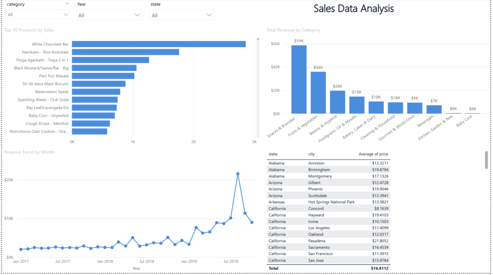

Look for issues with: chart types, axis fields, sorting, column ordering, and visual titles. Nothing requires new data — it's all about using the right fields in the right places.

---

### Part B — Build a New Summary Page from Scratch (30–40 min)

Add a **new page** to your report and name it `Sales Summary`. Build the dashboard shown in `challenge-mockup.html` using the `sales`, `producthierarchy`, and `store_cities` tables you've already loaded and related.

**Required visuals:**

| Visual | Type | Key fields |
|---|---|---|
| Total Revenue | Card | SUM of revenue column |
| Total Orders | Card | COUNT of order_id |
| Avg Revenue / Order | Card | Revenue ÷ Orders |
| Active Stores | Card | DISTINCTCOUNT of store_id |
| Monthly Revenue Trend | Line Chart | order_date (by Month) → revenue |
| Revenue by Product Category | Bar Chart | Category (from producthierarchy) → revenue |
| Top 10 Products by Revenue | Table | product name, category, revenue — Top N filtered |
| Revenue by State | Bar Chart | State (from store_cities) → revenue, Top 10 |

**Required slicer:**
- Add a **Year slicer** using the order_date column — students should be able to filter the whole page to 2017, 2018, or 2019 individually.

**Things you'll need to figure out:**

- The `producthierarchy` table has a column called `category || sub_category` — you'll need to split it in Power Query to extract just the category
- The `store_cities` table has state information embedded in a combined column (e.g., "TX – Texas – Houston") — you may need to split or extract just the state abbreviation
- Your line chart date axis should show months, not individual days — use the date hierarchy or set the axis to "Month" level
- Format all revenue values as currency

**Success criteria:**
- [ ] 4 KPI cards visible at the top
- [ ] Line chart shows a rising trend from 2017 → 2019
- [ ] Category bar chart pulls from the `producthierarchy` table (not the `sales` table directly)
- [ ] Top 10 Products table uses a Top N filter on `product_id` or product name
- [ ] State bar chart pulls location from `store_cities` table
- [ ] Year slicer cross-filters all visuals on the page
- [ ] Consistent color scheme applied

**Stretch goal:** Add a **promotion analysis** visual — a column chart comparing revenue for orders with a promotion (`promo_type_1` is not blank) vs. without promotion. This will tell you whether promotions actually drive higher revenue.


----

## Understanding the Data Model (Deeper Dive)

### What is a Data Model?

In Power BI Desktop, the **data model** is:

- The tables you've loaded
- The relationships between them
- Any calculated columns or measures (DAX formulas)

Everything lives in the `.pbix` file.

### Fact vs Dimension Tables

**Fact Tables** (Transactional):

- Contain measurable events (sales, orders, clicks)
- Usually have foreign keys to dimension tables
- Examples: `sales`, `orders`, `transactions`
- Often have large row counts

**Dimension Tables** (Descriptive):

- Contain attributes/properties
- Provide context to facts
- Examples: `products`, `customers`, `stores`, `dates`
- Usually smaller row counts

**Star Schema** (Recommended):

- Fact table in center
- Dimension tables around it
- Simple, fast performance

### Calculated Columns vs Measures (Preview)

While we haven't created these yet, here's the difference:

| Calculated Column                  | Measure                                      |
| ---------------------------------- | -------------------------------------------- |
| Row-by-row calculation             | Aggregation across rows                      |
| Stored in the table                | Calculated on-the-fly                        |
| Uses disk space                    | No storage cost                              |
| Example: `Profit = Revenue - Cost` | Example: `Total Sales = SUM(Sales[Revenue])` |

> [!note]
>
> We'll cover **DAX** (Data Analysis Expressions) for creating measures in Day 2. For now, focus on using the built-in aggregations (Sum, Average, Count).

------

## Data Refresh in Power BI Desktop

### How Refresh Works in Desktop

Unlike the Service (which can schedule automatic refreshes), Desktop requires **manual refresh**:

1. Click **Home** → **Refresh** button
2. Or press **F5**
3. Power BI re-runs all Power Query steps and reloads data

### When to Refresh

- When source CSV files have changed
- After editing Power Query transformations
- Before publishing to Service (ensure latest data)

### Data Sources and Refresh

**Static Files (CSV, Excel)**:

- Power BI stores the file path
- If file moves, refresh will fail (you'll need to update the path)

**Databases (SQL, etc.)**:

- Refresh pulls latest data from the live connection
- Requires credentials to remain valid

> [!tip]
>
> To change a data source path: **Home** → **Transform Data** → In Power Query, click the gear icon next to "Source" step in Applied Steps.

------

## Exporting and Sharing (Desktop)

### Sharing the .pbix File

Since we're not using Power BI Service, you can share reports by:

1. **Email the .pbix file**:
   - Recipients need Power BI Desktop installed (free)
   - They open the file and interact with it
   - File size can be large if lots of data
2. **Save to shared network drive**:
   - Team members access the same file location
   - Only one person can edit at a time (like Excel)
3. **Publish to Service** (if you get Pro later):
   - **Home** → **Publish**
   - Choose workspace
   - Creates web link others can access

> [!important] When sharing .pbix files, ensure data sources are accessible to recipients. If using a file path like `C:\MyData\sales.csv`, the recipient won't have access unless they have the same file in the same location.

------

## Power Query: Additional Concepts (Reference)

### Handling Errors

When transformations fail on some rows:

**Error indicator**: Red "Error" text in cells **Column quality bar**: Shows percentage of errors (top of column when profiling is on)

**Common error handling:**

- **Replace Errors**: Right-click column → Replace Errors → Enter replacement value (e.g., `0` or `null`)
- **Remove Errors**: Right-click column → Remove Errors (deletes rows with errors)
- **Keep Errors**: Right-click column → Keep Errors (useful for investigating what's breaking)

### Append Queries

Combine tables with the **same structure** (like stacking data):

**Example**: Combining monthly sales files

1. **Home** → **Append Queries**
2. Select tables to combine
3. Creates one unified table

**When to use**: Multiple files with identical columns (Jan_Sales, Feb_Sales, Mar_Sales)

### Merge Queries

Join tables on a key column (like SQL JOIN):

**Example**: Adding customer details to orders

1. **Home** → **Merge Queries**
2. Select matching columns from each table
3. Choose join type:
   - **Left Outer**: Keep all rows from left table
   - **Inner**: Only matching rows
   - **Full Outer**: All rows from both
4. Expand the merged column to bring in desired fields

> [!important]
>
> **Merge vs Relationships**: Use **Merge** in Power Query when you want to denormalize data (flatten into one table). Use **Relationships** in the model for star schema (keeps tables separate, better performance for large datasets).

### Conditional Columns

Add a column with if/then/else logic:

1. **Add Column** → **Conditional Column**
2. Define conditions:
   - If `revenue` > 100 then "High"
   - Else if `revenue` > 50 then "Medium"
   - Else "Low"

**When to use**: Categorizing data (Revenue Tiers, Age Groups, Performance Ratings)

### Group By (Aggregations)

Roll up data by categories:

1. **Transform** → **Group By**
2. Select grouping columns (e.g., `category`)
3. Add aggregation (e.g., Sum of `revenue`)
4. Result: One row per category with total revenue

**When to use**: Pre-aggregating data before loading (reduces model size)

------

## Organizing Your Work

### File Naming Conventions

Since everything is in `.pbix` files, use clear names:

**Good**:

- `Sales_Analysis_2017.pbix`
- `Customer_Dashboard_v2.pbix`
- `Inventory_Report_Jan2025.pbix`

**Bad**:

- `Report.pbix`
- `Final.pbix`
- `Test123.pbix`

### Version Control

Desktop doesn't have built-in version control like the Service, so:

**Option 1**: Manual versions

- `Sales_Report_v1.pbix`
- `Sales_Report_v2.pbix`
- Keep old versions in an archive folder

**Option 2**: Use cloud storage with version history

- OneDrive/SharePoint (auto-versioning)
- Google Drive
- Dropbox

**Option 3**: Git/Source control (advanced)

- Use `.pbix` as binary files
- Or use **Power BI Projects** (PBIP format, new feature) for text-based version control

> [!tip]
>
> Before making major changes, **Save As** a new version. Desktop doesn't have an undo history across sessions.

------

## Day 1 Summary

Today we covered:

| Topic                  | Key Takeaways                                                |
| ---------------------- | ------------------------------------------------------------ |
| **Desktop vs Service** | Desktop is free, offline, saves as .pbix files; all core functionality is identical |
| **Interface**          | Report View (design), Table View (verify data), Model View (relationships) |
| **Getting Data**       | Import CSV via Get Data; use **Load** for clean data, **Transform Data** for messy data |
| **Power Query**        | Data transformation tool: remove rows, change types, split columns, clean text, handle errors |
| **Data Model**         | Tables connected via relationships; fact tables (center) + dimension tables (around) |
| **Relationships**      | Connect tables on key columns (e.g., product_id); enables cross-table analysis |
| **Visualizations**     | Column charts, bar charts, line charts, tables - drag fields to wells, format as needed |
| **Slicers**            | Interactive filters on the canvas; let users filter the entire report |
| **Applied Steps**      | Each Power Query transformation is a step; can edit, delete, reorder |
| **Refresh**            | Manual only in Desktop (F5); re-runs Power Query and updates data |

### Key Files Created Today

1. `NY_Property_Sales.pbix` - First report with basic charts
2. `Sales_Data_Analysis.pbix` - Multi-table model with relationships and slicers

------

## Practice Exercises (Homework)

1. **Add a new chart** to the Sales Data Analysis report:
   - Create a pie chart showing revenue by sub_category
   - Add a slicer for `promotion` (Yes/No)
2. **Create a new page**:
   - Add visuals showing delivery performance:
     - Average days from order to ship (need to create a calculated column: `ship_date - order_date`)
     - Count of orders by status
3. **Explore Power Query**:
   - Add a custom column that calculates `profit = revenue * 0.3` (assuming 30% margin)
   - Try grouping the sales data by `category` and `year` to create a summary table
4. **Experiment with visual interactions**:
   - Add a new page
   - Create 3 visuals
   - Test cross-filtering behavior
   - Try **Format** → **Edit interactions** to control which visuals filter each other

------

## Next Steps: Day 2 Preview

Tomorrow we'll dive into:

- **DAX (Data Analysis Expressions)**: Create custom measures and calculated columns
- **Time Intelligence**: Year-over-year growth, running totals, moving averages
- **Advanced Visuals**: Drill-down, drill-through, tooltips, bookmarks
- **Performance Optimization**: Reduce file size, improve query speed

------

## Additional Resources

- [Power BI Desktop Download](https://powerbi.microsoft.com/desktop)
- [Microsoft Learn: Power BI Documentation](https://learn.microsoft.com/en-us/power-bi/)
- [Power Query M Function Reference](https://learn.microsoft.com/en-us/powerquery-m/power-query-m-function-reference)
- [Power BI Community Forums](https://community.powerbi.com/)
- [DAX Guide](https://dax.guide/) (for Day 2)

------

## Troubleshooting Common Issues

### Data Won't Load

**Problem**: Error when clicking Load or Close & Apply **Solutions**:

- Check if CSV file still exists at the original path
- Verify data types don't cause conflicts (e.g., text in a number column)
- Look at error messages in Applied Steps - click the failed step

### Relationship Won't Create

**Problem**: Can't drag to create relationship **Solutions**:

- Ensure both columns are the same data type (both Text, or both Number)
- Check if relationship already exists (can only have one active relationship per column pair)
- Verify there are matching values in both columns

### Visual Doesn't Show Data

**Problem**: Chart is blank even though data exists **Solutions**:

- Check Filters pane - may be filtered to empty results
- Verify the field is actually in the correct well (X-axis vs Y-axis)
- Ensure relationships exist between tables if using fields from multiple tables

### File Size Too Large

**Problem**: .pbix file is huge (>100 MB) **Solutions**:

- Remove unnecessary columns in Power Query (before loading)
- Filter out historical data you don't need
- Use Import mode instead of DirectQuery if applicable
- Check for large text/image columns

### Can't Find a Feature

**Problem**: Interface looks different from screenshots **Solutions**:

- Check which View you're in (Report/Table/Model) - features differ by view
- Some options only appear when a visual is selected
- Ribbons collapse on smaller screens - click the small arrow to expand groups

------

