# PowerBI Service (Day 1)

## Learning Objectives

By the end of Day 1, you will be able to:

- Understand how Power BI Service fits within the Microsoft Fabric ecosystem
- Navigate the Power BI Service interface confidently
- Upload data and create basic visualizations (column, bar, and line charts)
- Explain what a semantic model is and why it matters
- Use Power Query to clean and transform data (remove rows, change data types, split columns, handle errors)
- Create relationships between multiple tables
- Build a simple dashboard with interactive visuals

---

## Microsoft Fabric Ecosystem Overview

### What is Microsoft Fabric?

Microsoft Fabric is a unified, end-to-end analytics platform that brings together all the data and analytics tools organizations need. Think of it as a "one-stop shop" for data engineering, data science, real-time analytics, and business intelligence.

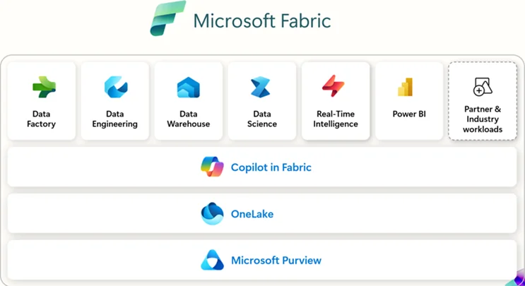

### Key Fabric Workloads

| Workload | Purpose |
|----------|---------|
| **Power BI** | Business intelligence, reporting, and visualization |
| **Data Factory** | Data integration and ETL/ELT pipelines |
| **Data Engineering** | Big data processing with Spark (Lakehouses, Notebooks) |
| **Data Warehouse** | Enterprise SQL-based data warehousing |
| **Data Science** | Machine learning and AI experiments |
| **Real-Time Intelligence** | Real-time analytics, streaming, and KQL databases |
| **Data Activator** | Automated actions and alerts based on data changes |

### Where Power BI Fits

Power BI is the **visualization and reporting layer** of Fabric. While Power BI existed before Fabric, it is now deeply integrated:

- **OneLake**: All Fabric workloads, including Power BI, store data in OneLake (Fabric's unified data lake)
- **Shared Security**: Row-level security and permissions work across Fabric
- **Direct Lake Mode**: Power BI can query data directly from the lakehouse without importing
- **Unified Experience**: You access Power BI through the same Fabric portal

> [!note]
> For this course, we focus on Power BI capabilities. However, as you navigate the interface, you may see options for other Fabric workloads depending on your organization's licensing.

### Licensing Quick Note

- **Power BI Free**: Personal use, cannot share content
- **Power BI Pro**: Share and collaborate, included in Microsoft 365 E5
- **Power BI Premium / Fabric Capacity**: Enterprise features, larger datasets, advanced AI

---

## Power BI Service Interface Tour

### Accessing Power BI Service

Navigate to [app.powerbi.com](https://app.powerbi.com) and sign in with your organizational account.

### Main Navigation (Left Pane)

| Element | Description |
|---------|-------------|
| **Home** | Your personalized landing page with recent items and recommendations |
| **Browse** | Explore content shared with you, recent items, and favorites |
| **Create** | Start new reports, semantic models, dashboards, and more |
| **OneLake data catalog** | Access data across the Fabric ecosystem |
| **Workspaces** | Organized containers for your content (see below) |

### Understanding Workspaces

Workspaces are **containers** that hold related Power BI content (reports, dashboards, semantic models, dataflows).

- **My workspace**: Your personal sandbox. Content here is private to you.
- **Shared workspaces**: Collaborative spaces where teams work together. Requires Pro license or Fabric capacity to share.

> [!tip]
> Think of "My workspace" as your personal drafts folder. Move content to a shared workspace when ready to collaborate.

### Artifact Types in Power BI

| Artifact | Description |
|----------|-------------|
| **Report** | Interactive visualizations with one or more pages |
| **Dashboard** | Single-page view with pinned tiles from reports |
| **Semantic Model** | The data model (tables, relationships, measures) |
| **Dataflow** | Reusable data preparation logic (Power Query in the cloud) |
| **Paginated Report** | Pixel-perfect reports for printing/PDF export |

### Reports vs Dashboards

| Feature | Report | Dashboard |
|---------|--------|-----------|
| Pages | Multiple pages | Single page only |
| Source | Built on one semantic model | Tiles from multiple reports |
| Interactivity | Full filtering, slicers, drill-through | Limited (click to open source report) |
| Use Case | Detailed analysis | Executive summary / KPI monitoring |

We will focus on **Reports** in this course, but you may pin visuals to dashboards later.

---

# Part 1: Intro

Main/Landing Page

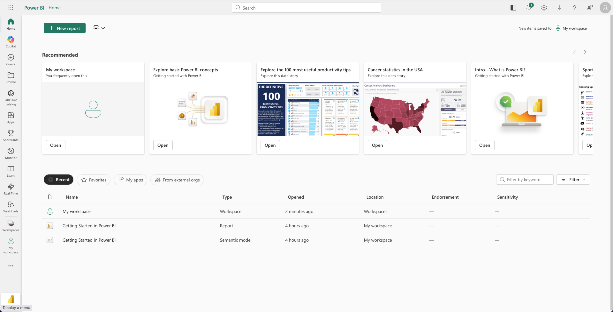

When you click __+ New report__

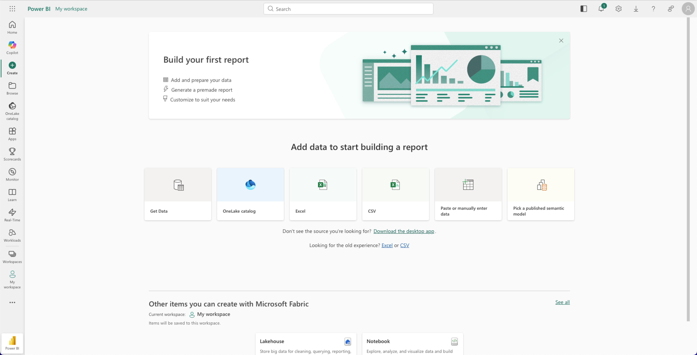

Uploading the `ny_property_sales.csv` dataset

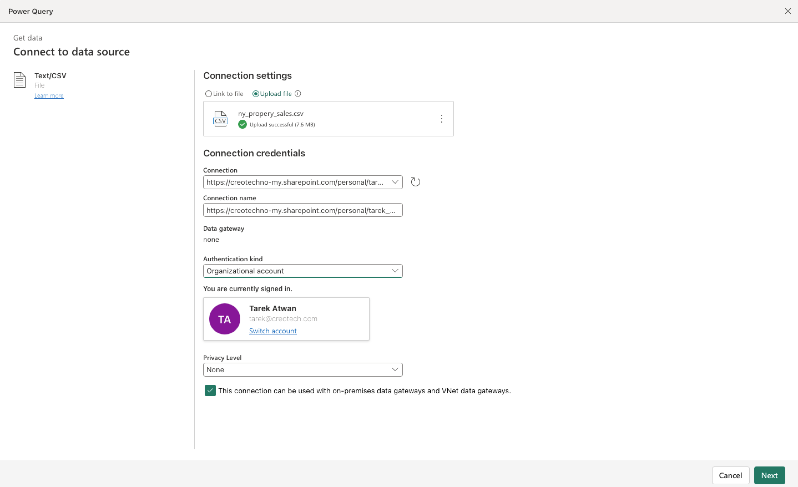

Click next, this will upload the file and open the Power Query screen

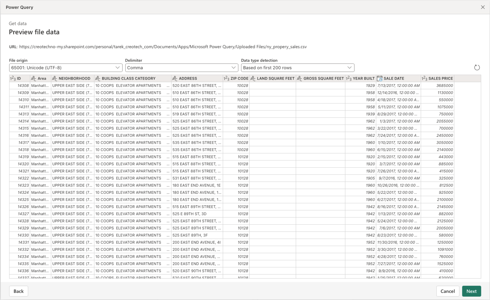

Click next. This will take you to the Power Query Editor to transform the data 

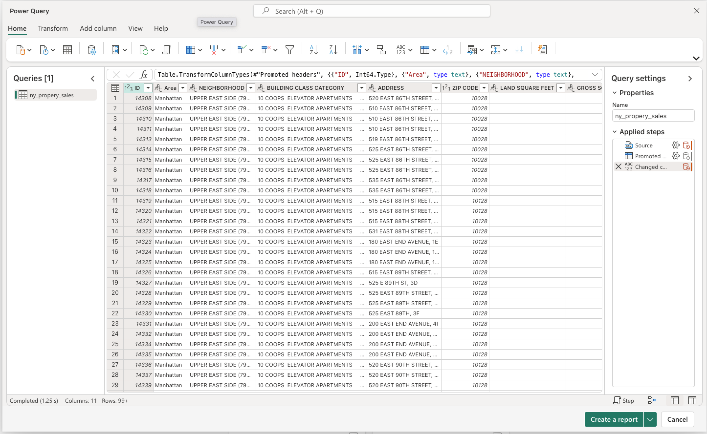

You can expand the menu as shown

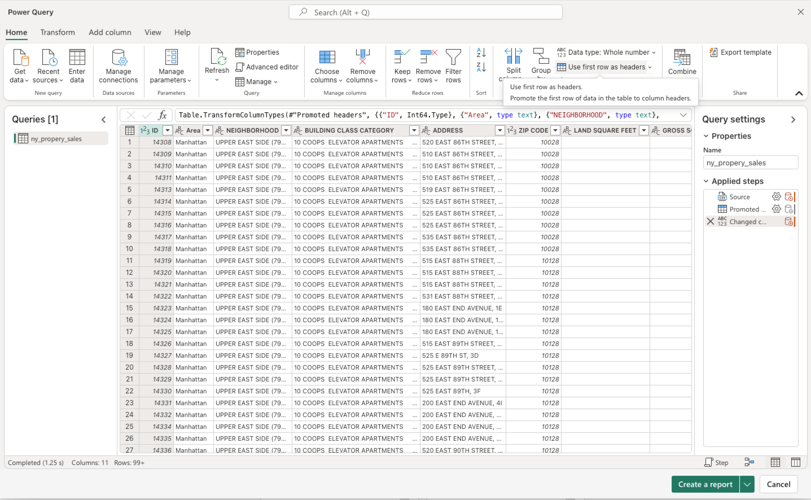

There are three views from the bottom right: **Diagram View**, **Show Data View**, **Show Schema View**

For now, we can click __Create a report__ to load the data and skip transformation step for now. You will be prompted to enter a name to the Semantic Model.

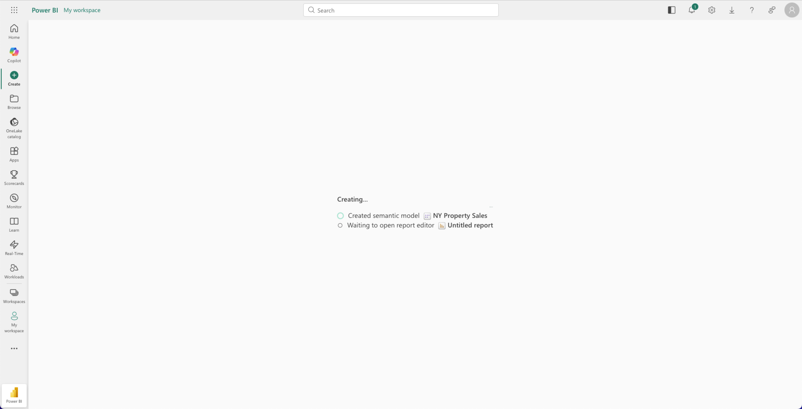

Check “My workspace” and you will see __NY Property Sales__ semantic model. Click on it. Click __Explore this data__

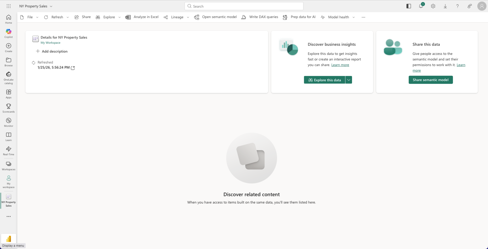

In the Editor, select __Area__ and __SALES PRICE__

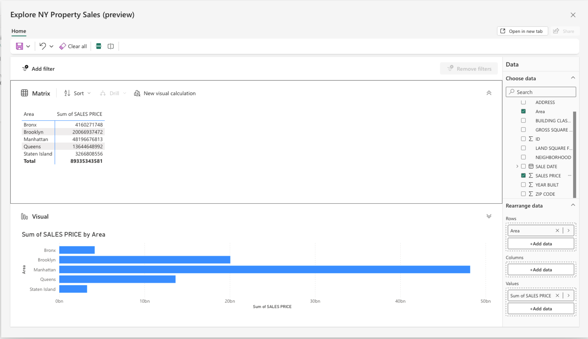

You can continue exploring the data. Once done, close the screen. No need to save the results for now.

Click **Explore**, then **Create a blank report**

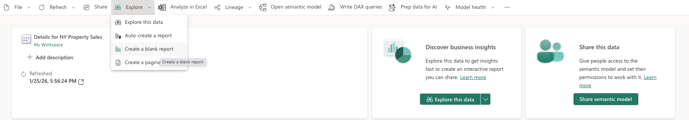

Now, you will be inside the main Power BI Report Canvas/Designer view

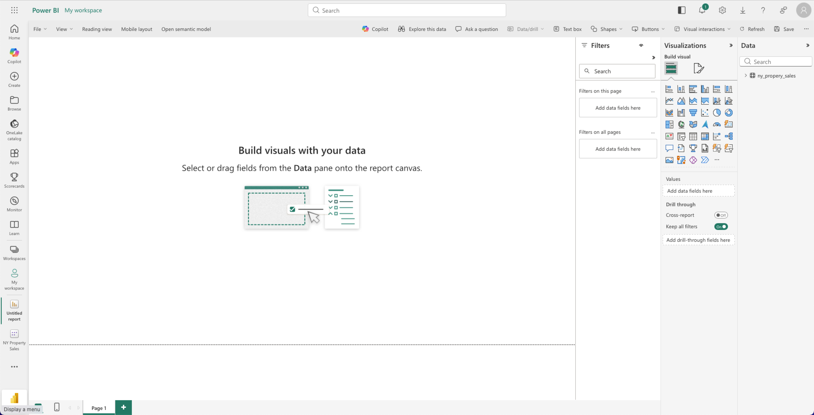

Create you report 

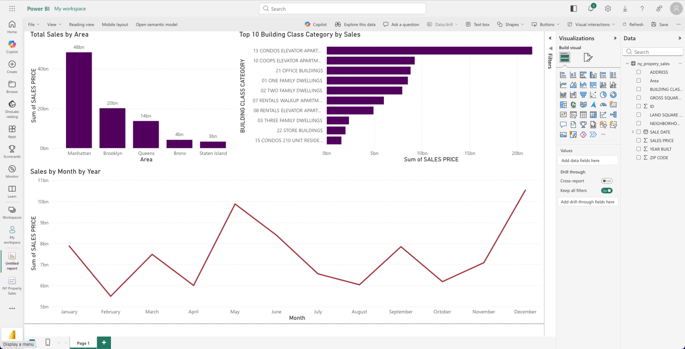

* **Total Sales By Area**
  * Stacked Column Chart 
  * X-axis: `Area` , Y-axis: `SALES PRICE` default using Sum
  * You can change line color from **Visualizations** panel, **Visual** tab, scroll to **Columns**, then **Color**.
  * You can rename the chart from **Visualizations** panel, **Format visual** tab, then **General** tab, then  **Title**.
* **Top 10 Building Class Category by Sales**
  * Stacked Bar Chart
  * Y-axis: `BUILDING CLASS CATEGORY`, X-axis: `SALES PRICE` default using Sum
  * In **Filters** panel, add `BUILDING CLASS CATEGORY` to **Filters on this visual** section. Select **Top N** as filter type, In show items select **Top** and enter `10` for top 10. Drag, `SALES PRICE` to the __By value__ option. 
  * You can change line color from **Visualizations** panel, **Visual** tab, scroll to **Bar**, then **Color**.
  * You can rename the chart from **Visualizations** panel, **Format visual** tab, then **General** tab, then  **Title**.
* **Sales by Month By Year**
  * Line Chart
  * X-axis: `SALE DATE`. Keep only Month. Y-axis: `SALES PRICE` default using Sum
  * You can change line color from **Visualizations** panel, **Visual** tab, scroll to **Line**, then **Color**.
  * You can rename the chart from **Visualizations** panel, **Format visual** tab, then **General** tab, then  **Title**.

You can save your report using **File**, then **Save**

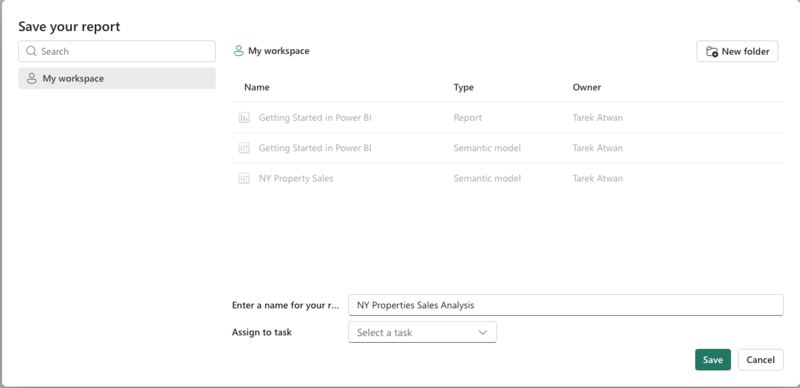

Click __Reading View__

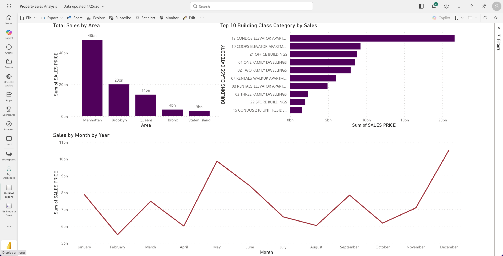

Once done, click the __Edit__ option to get back to edit mode. 

----

# Part 2: Using Sales 2017 Raw Data

* The sales data is Raw and messy.  This is sales data from an e-commerce store 
* The goal is to visualize the sales
  * Sales categories 
  * Promotions 
  * Sales over time 
  * Delivery time ..etc
* We need to transform the data, create a Data Model and visualize the data 
  * `sales_raw2017.csv`
  * `producthiearchies.csv`
  * And more …

## Create a Semantic Model

From __My workspace__ click __+ New item__. In the panel that appears, scroll down to __Store data__ and select __Semantic model__

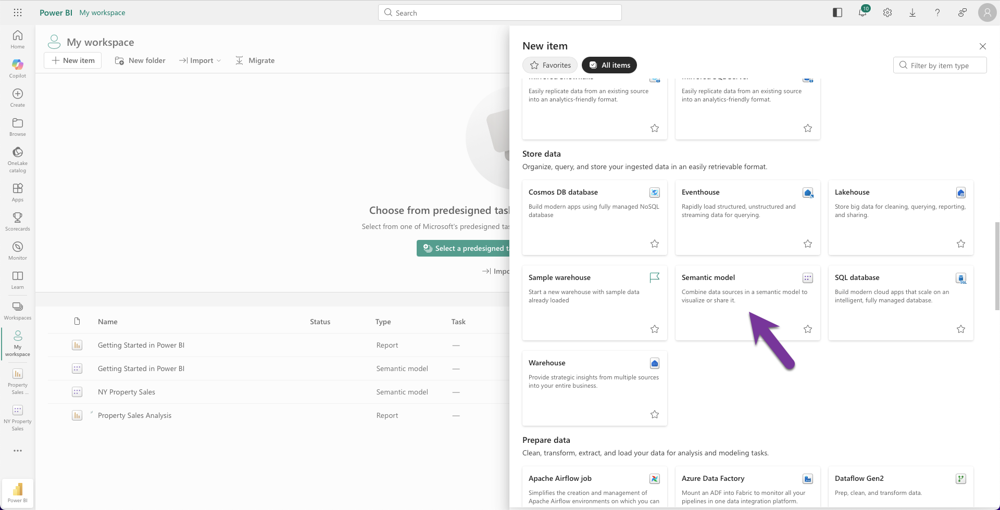

This will take you to the report screen similar to that in the first section of this course. Click the __CSV__ option and load the `sales2017_raw.csv` data. 

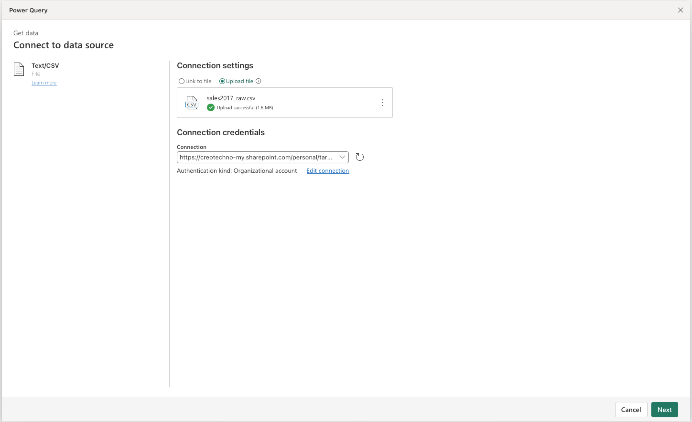

Then click **Next**, then **Next** again.

-----

> [!note]
>
> Every report in Power BI (Service/Fabric) is built on top of a semantic model, and that model must exist before (or as part of) creating the report. 

#### What a semantic model is

In Power BI, a **semantic** model is the data model that sits between your raw data sources and your reports. It is the curated layer that the report actually queries.

Concretely, a semantic model includes:

- Tables (typically fact and dimension tables) with their columns.
- Relationships between those tables (star/snowflake schema, many‑to‑one, etc.).
- Measures and calculations (DAX), plus business logic such as KPIs.
- Metadata like hierarchies, perspectives, translations, and roles for row‑level security.
- Connection mode definition (Import, DirectQuery, composite, etc.).

This layer is what the visual-level queries hit; the report never talks directly to your SQL database, Lakehouse, or Warehouse, it talks to the semantic model.

#### Relationship to older terms (datasets, models)

Historically in Power BI Service this was called a “dataset”; Microsoft renamed it to “semantic model” to better reflect that it is the organized business model used for reporting.

From a modeling perspective it is a tabular model (same engine as Analysis Services Tabular) containing tables, relationships, partitions and measures.

#### Where it fits in Power BI / Fabric

Typical lifecycle (Desktop or Fabric):

1. Connect to one or more data sources and shape data (Power Query, dataflows, Lakehouse/Warehouse tables).
2. Define the semantic model: relationships, measures, hierarchies, RLS, etc.
3. Publish to a workspace; in the Service/Fabric the .pbix splits into a report artifact and a semantic model artifact.
4. Build one or many reports that connect “live” to that published semantic model.

In Fabric Lakehouses and Warehouses you also get a default semantic model automatically generated on top of your tables, which you can then customize or replace with a custom model.

#### Why it matters

==**Because the semantic model centralizes business logic**==, it becomes the “**single version of the truth**” that multiple reports and users can reuse. This improves consistency, governance, and performance (caching, aggregations, etc.), and lets business users focus on building visuals rather than wrangling raw data

-----

## Power Query

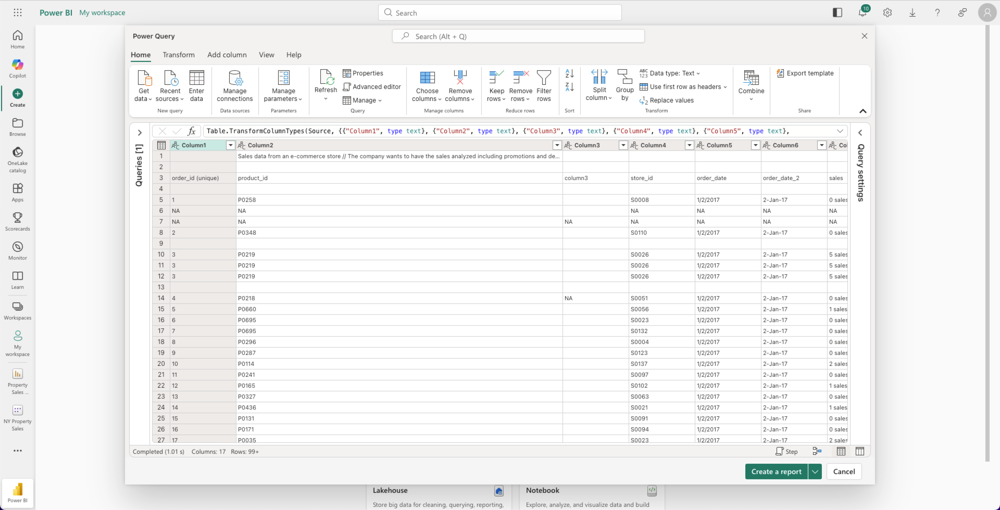

Let’s do the following transformation to clean and prepare our dataset:

1. The first two rows are not part of the actual data and should be removed. 

   1. From the **Home** menu, click __Remove rows__, then select __Remove top rows__, then specify 2 as the Number of rows. Click ok.
   2. On the right panel, under **Query settings**, you should see 3 steps under **Applied steps** section. 

2. The first row represent the headers now. 

   1. From the **Home** menu, click __Use first row as headers__ .
   2. Verify that the first row has been removed and is not the header.

   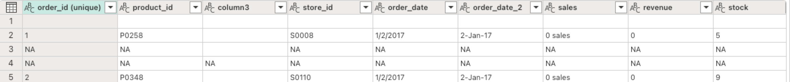

3. If you would like to see a data profiling feature, similar to that in Power BI desktop, click on the __View__ menu, click __Data view__, then update with the following configuration (check boxes):

   1. Check __Enable column profile__
   2. Check __Show column quality details__
   3. Check __Show column value distribution__
   4. Check __Show column profile in details pane__

   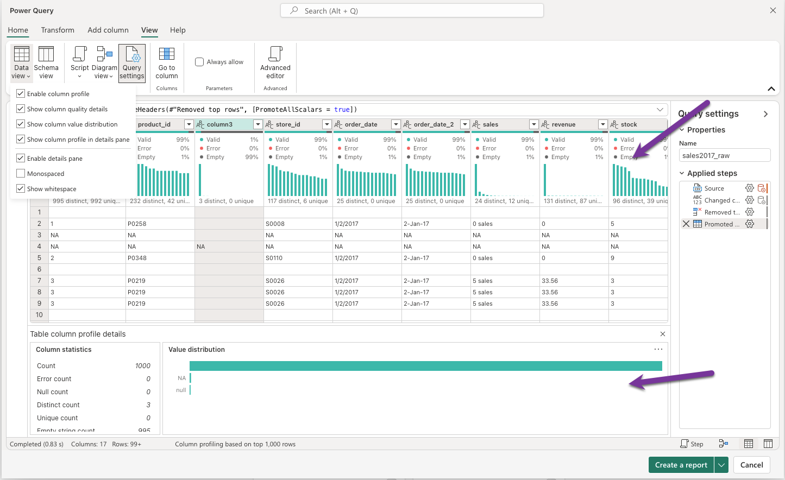

4. Notice __column 3__ is mostly blank (null, NA, and blank). Let’s remove this column

   1. Select `column 3` then from the __Home__ menu select __Remove columns__ option 

5. Notice row 1 and row 6 are completely blank rows. Let’s remove completely blank rows.

   1. From the __Home__ menu, select __Remove Rows__, then select __Remove blank rows__ 

   2. If you scroll to row 30 (order_id = 26), it is a blank row, but it was not remove because we have an order_id. We can remove such rows if we select a different column, for example __product_id__, then filter the column to remove rows that are `NA` or `(blank)` but unchecking them. Then click **Ok**.

      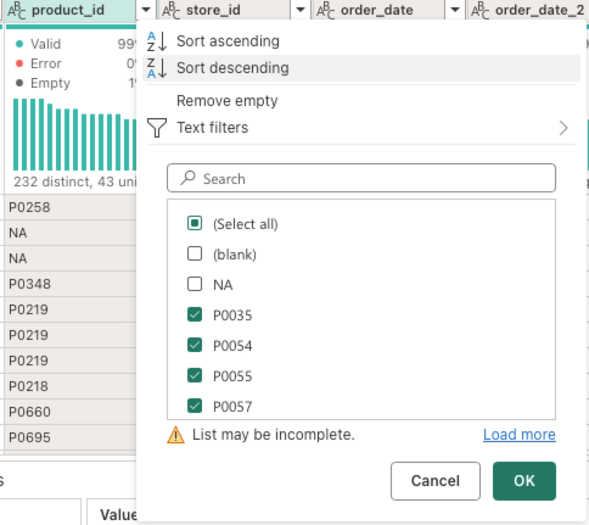

6. If you examine rows (3, 4, and 5) you will notice they are actually duplicates. We may have other duplicates as well. Let’s remove these duplicates.

   1. There are different ways to do this. If we want to remove complete duplicate rows (all columns), then we need to make sure no column is being selected, then from __Home__ menu we click __Remove rows__, then we select __Remove duplicates__

   2. An alternative and easier options, is from the top left corner of the tabular view, click on the table icon, then select __Remove duplicates__

      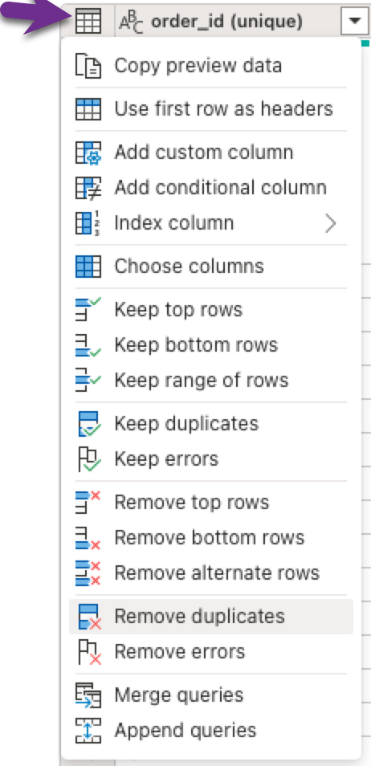

### Changing Data Types

7. On the bottom right, the last icon represents the __Schema view__ 

   Notice, all columns loaded form the CSV are of type `Text`. For example, in order to be able to apply any aggregation to `revenue` we need to change it from `Text` to `Currency` 

   1. Here is how you can make transformations from the __Schema view__

      1. Click on the `...` new to any column and you will see a list of options including __Change type__. 

         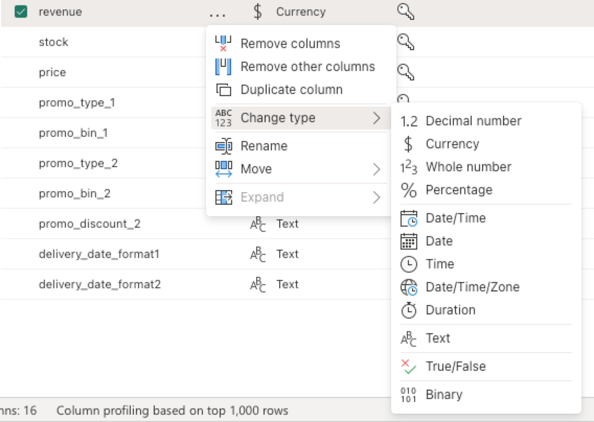

      2. Double click any column name, for example, `order_id (unique)` and you are able to rename the column 

      3. You can use the check box to select multiple columns and perform a transformation to all of them at once. For example, select `order_date` and `order_date_2`, then select __Change type__, then __Date__

         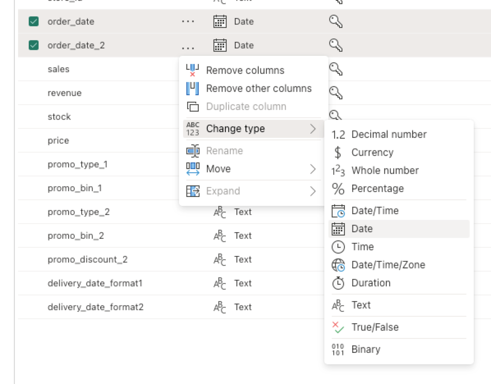

      4. Try and perform transformation from the __Schema view__ to match the following output 

         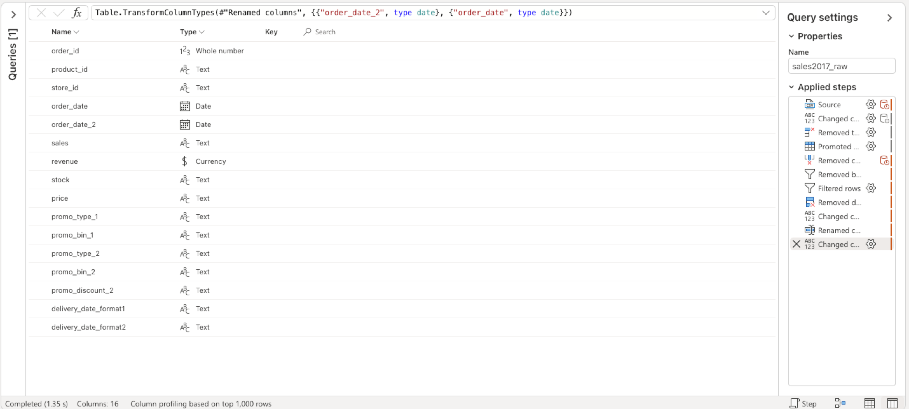

         Once done, go back to the data view by clicking the icon to the left of the schema view: 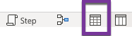

8. In the data view, scroll to the last two columns `delivery_date_format1` and `delivery_date_format2`. The first uses a standard USA date format (month/day/year) while the second uses a non standard date format (for USA). If you attempt to change the format on the second one to date, some dates will error out. In order to achieve this successfully you will need to change the __locale__

   1. For the `delivery_date_format2` column, click on the top left corner of that column (the ABC icon), then select __Using locale…__. A window may pop, select __Add new step__.  Then, select `Date` as __Data type__, and `Englis (United Kingdom)` for __Locale__, then click __OK__

      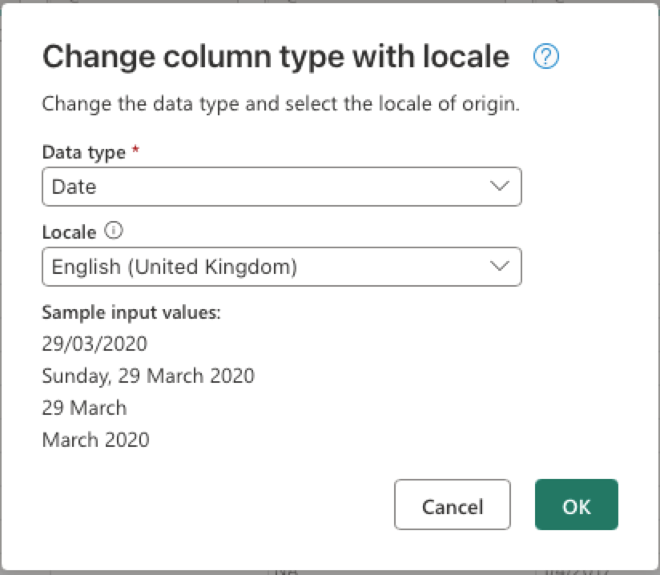

   2. Validate that you have no errors. Check that you have 100% valid transformation and 0% error

      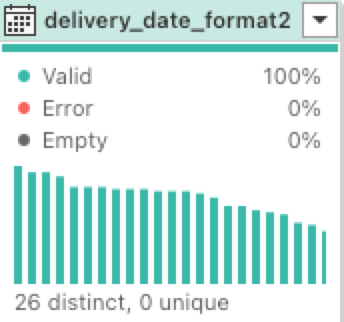

       

   3. Do the same for `delivery_date_format1`, select __Using locale__, then choose  __Add new step__, `Date` as the Data type, select `English (United State)` as locale, and make sure you have 100% valid records after the transformation. 

9. Power Query has an option to Auto detect data types. Let’s see if this can help us to detect/update the remaining columns. 

   1. From the __Transform__ menu, select __Detect data type__ option. You may get the following message “We didn’t detect any better data types than the ones you are already using”. This means, we may need to continue to do things manually as needed.
   2. The `Price` column is still a text value. This is because there is an `NA` value. You can verify this by click on the view values option from the top right of the column, scroll all the way down and you may see it:

   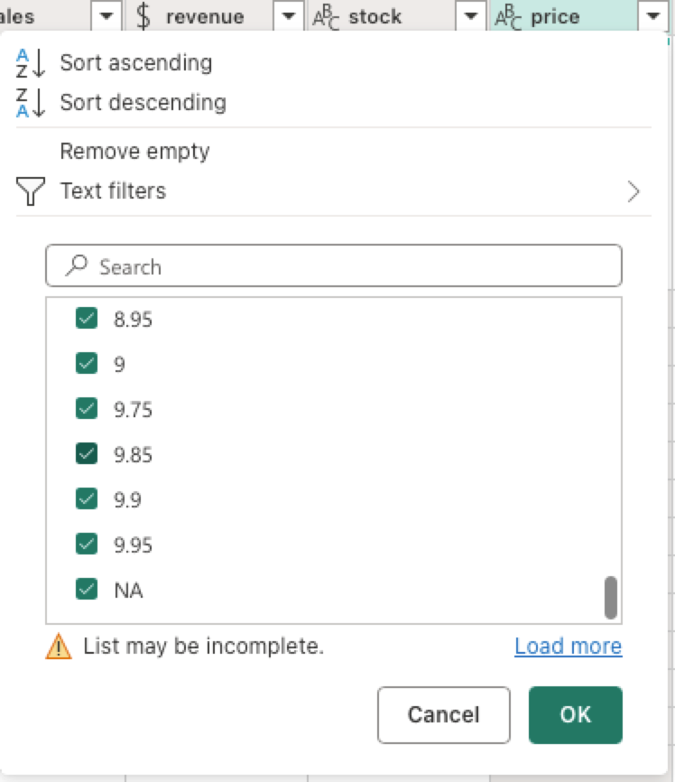

   ​	Uncheck the `NA`. Try the __Detect data type__ again, and you will see  `Price` column changing from Text to Decimal number.  Let’s manually make

   ​	another change, from the __Data type__ option on the top menu (which currently indicates it is a Decimal number), click on that, and change it to 	__Currency__. If prompted, select __Replace current__.

10. If you observe the `Sales` column, you will see we have both a numeric value and a text. Hence, why it is coming as text. We need to be able to adjust this to convert `Sales` into a numeric data type.
    1. Select the `Sales` column
    2. You can remove the word `sales` by using __Replace values__ option from the __Home__ menu. 
    3. In the __Replace values__ box: type `sales` in the __value to find__, and leave __Replace with__ as blank. Then click __OK__
    4. Now, change the data type from Text to Whole number.
11. Manually update `stock` from Text to Whole Number. Always check that you have 100% valid values for the columns and 0% errors. 
12. In `promo_bin_1` let’s replace `verylow` with `very low`

Once you have completed these tasks you should have the following data types:

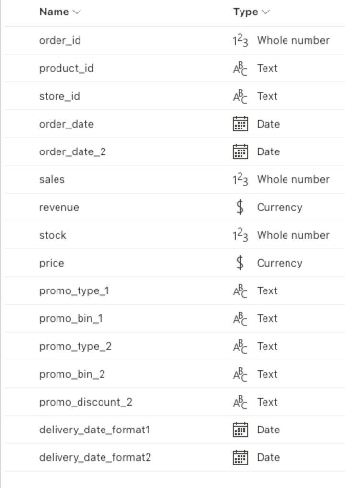

And a similar list of steps

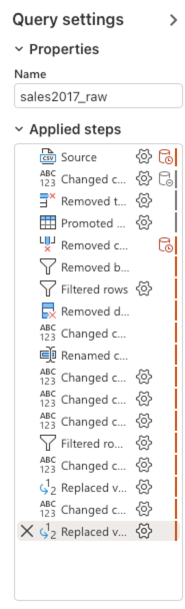

----

## Add another Data Source (Store Cities)

1. From the __Home__ menu click __Get data__, select __Text/CSV__ option, then load the `store_cities.csv` file. Click __Next__, then click __Create__

   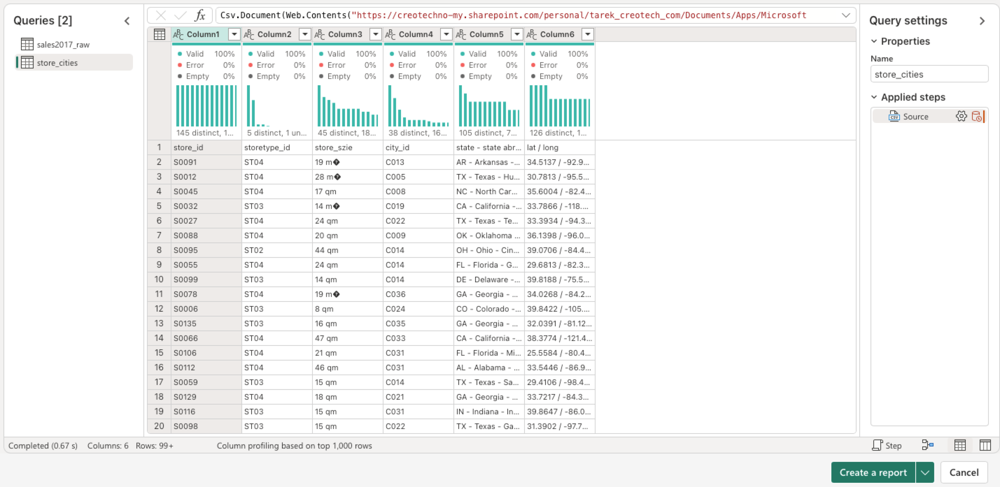

2. Rename the sources by double clicking their names

   1. `store_cities` to `stores`
   2. `sales2017_raw` to `sales 2017`
   3. We can connect the two dataset through the `store_id` column present in both.

3. We need to clean the dataset first:

   1. Make the first row as headers. You can do this by selecting __Use first row as headers__

4. The `store_size` column we can extract the measures (values)

   1. Click on `store_size`. From the __Transform__ menu select __Extract__, then __Text Before Delimiter__
   2. For the __Delimiter__ you can enter a space then click OK.
   3. Rename the column rom `store_size` to `store size`.  One way to accomplish this is by double clicking the column name.
   4. Change the data type from `Text` to `Whole Number`

5. You will need split state, state abbreviation, and city in the `state - state abr - city` column.

   1. Select the `state - state abr - city` column. From he __Home__ menu select __Split column__, select __By delimiter__

   2. In the __Separator__ drop down, select `--Custom--`, and type a hyphen `-`

   3. This should split the column into three columns. If you did not get three columns, click on edit option to edit the step and check in Advanced that __Each occurrence of the delimiter__ option is selected, and __Number of columns to split into__ it set to 3.

      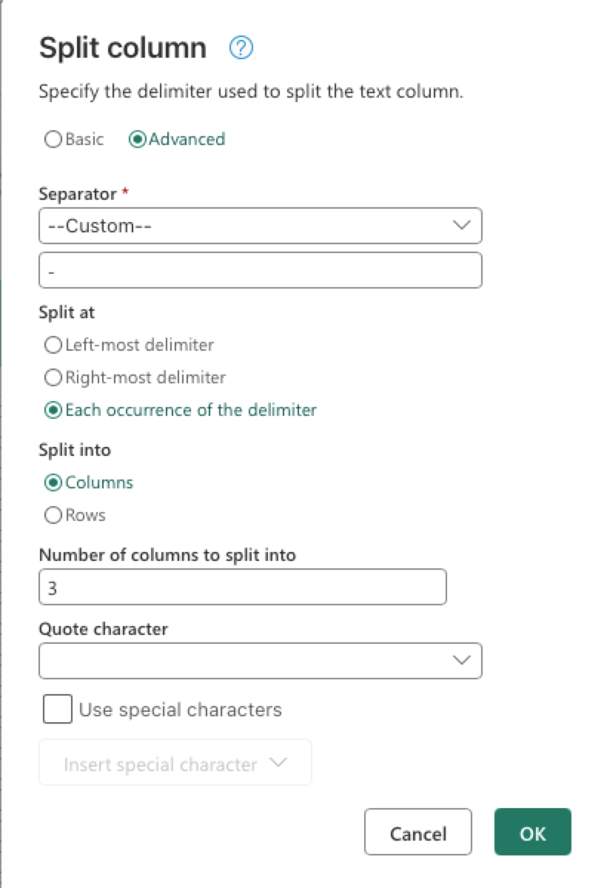

   4. Finally, rename the columns: `state abr`, `state`, and `city`

6. Finally, split the last column `lat/long`

   1. Similar to step 5, select __Split column__, select `--Custom--` separator, then type ` /` (space then `/`). Click OK.
   2. Rename the columns to `lat` and `long`

7. To to __Transform__ menu, and try the __Detect data type__ for the remaining columns. 

8. When we did split columns, some values had leading white spaces that are hard to see. 

   1. For `state` column, you can right click, go down to select __Transform column__, then select __Text transforms__, then select __Trim__
   2. Do the same for the `city` column

## Add Products Hierarchies dataset

Add another data source and load the `producthierarchy.csv` dataset. The product hierarchy dataset can be joined with the `sales 2017` dataset through the `product_id` columns. Obviously, the dataset requires some cleaning and preparation as well. Rename the dataset to `products`.

1. Use the first row as header 

2. The `product (brand)` column contains some unwanted characters including special control characters like tab. This can be cleaned using the __clean__ tool.

   1. Select `product (brand)` column, right-click, select __Transform column__, then __Text transforms__, then __Clean__
   2. In the __Text transforms__ apply __Capitalize Each Word__

3. The last column `category || sub_category` needs to be split into two columns `category` and `sub_category`

   1. You can split using ` || ` for a clean split (space `||` then space)

4. We can do a split to the `length x depth x width (in cm)` column into three columns: `length`, `depth`, `width`

   1. You can split using ` x ` (space `x` space)
   2. Convert from CM to Inches (1 cm approximately equals 0.394 inches)
      1. Select `length` column. From the __Add column__ menu, select __Standard__, then select __Multiply__, and enter `0.394` then click OK.
      2. Do the same for `depth` and `width` columns
      3. Rename the newly created columns to indicate they are inches, `length (inches)`, `depth (inches)`, and `width (inches)`

5. __Challenge__

   1. The `product (brand)` column consists of the product followed by the brand in parenthesis for example `Serum (Livon)`
   2. Split the column into two: `product` and `brand` columns

   > [!tip]
   > **Hint**: Use Split Column by Delimiter with `(` as the delimiter. After splitting, you'll need to remove the trailing `)` from the brand column using Replace Values.

   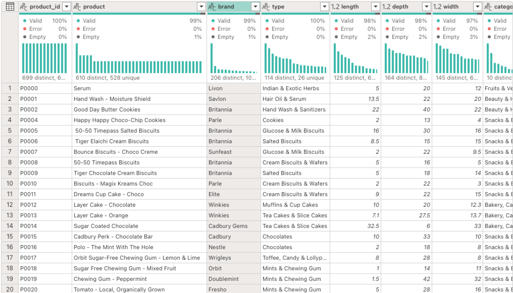

   Once all is done here is the schema:

   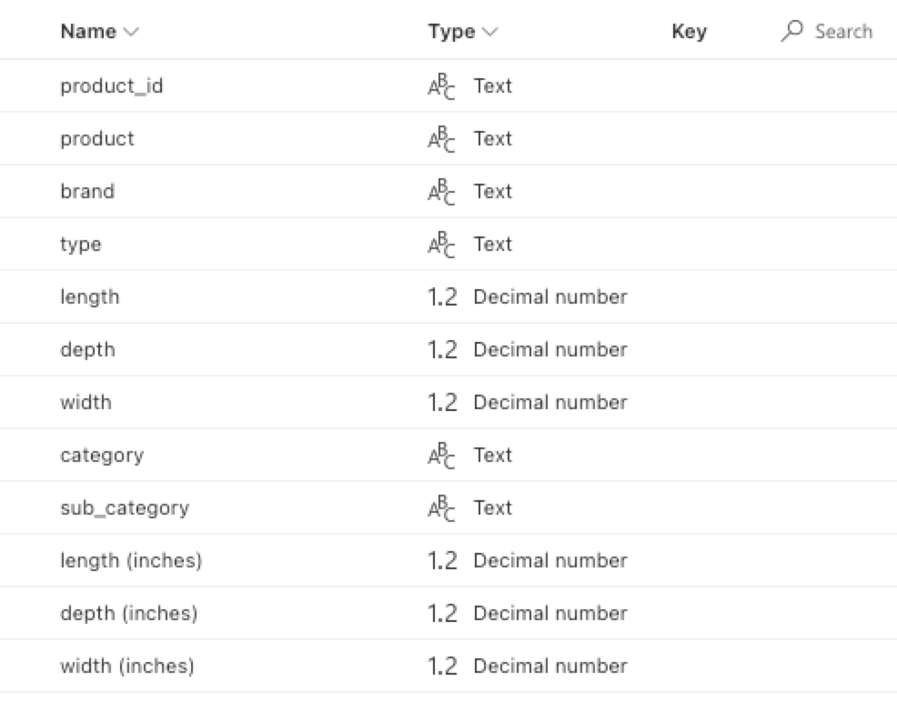

----

In the bottom from the __Create Report__, change it and select __Create Semantic Model Only__, you can name it `Sales Data`

-----

## Combining Data with relationships/Data Model

Once the `Sales Data` is saved, you will see the following screen:

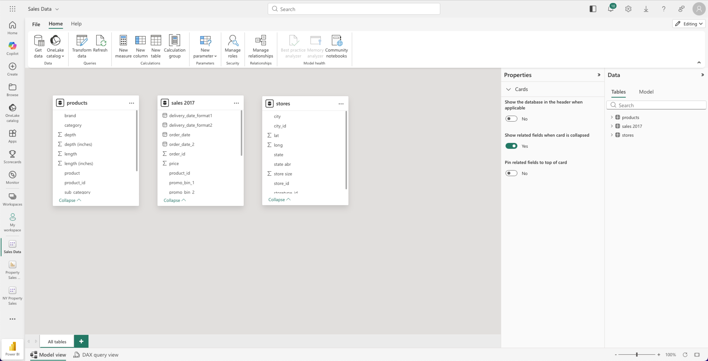

1. From __sales 2017__ drag the `product_id` column to the `product_id` in the __products__ table. A screen will pop as shown:

   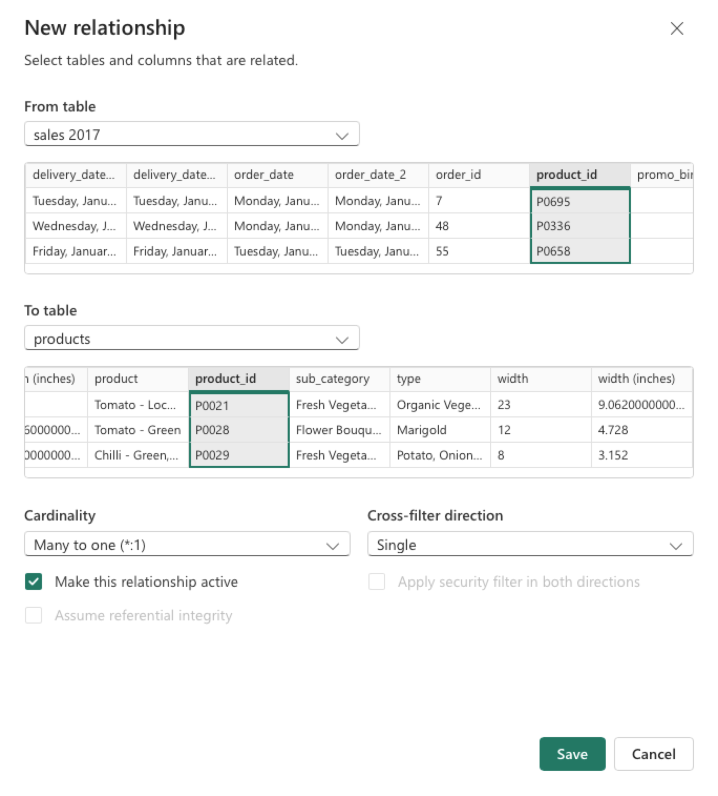

   Click __Save__

2. Drag `store_id` from __sales 2017__ table to join with `store_id` from __stores__ table

   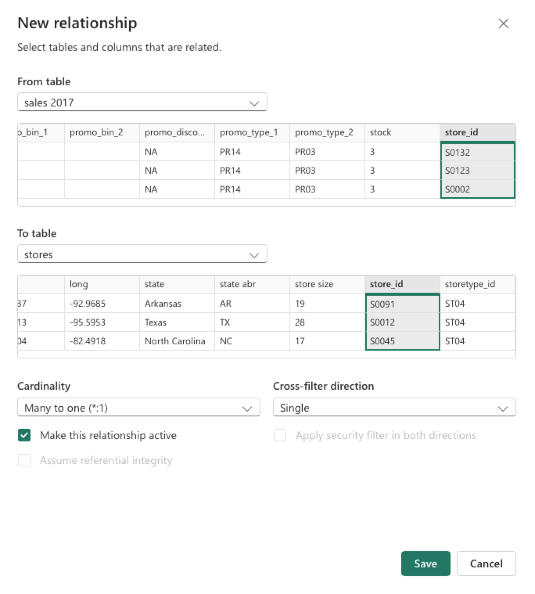

   Click __Save__. You should see the final data model showing how the tables are joined together (relationship):

   

   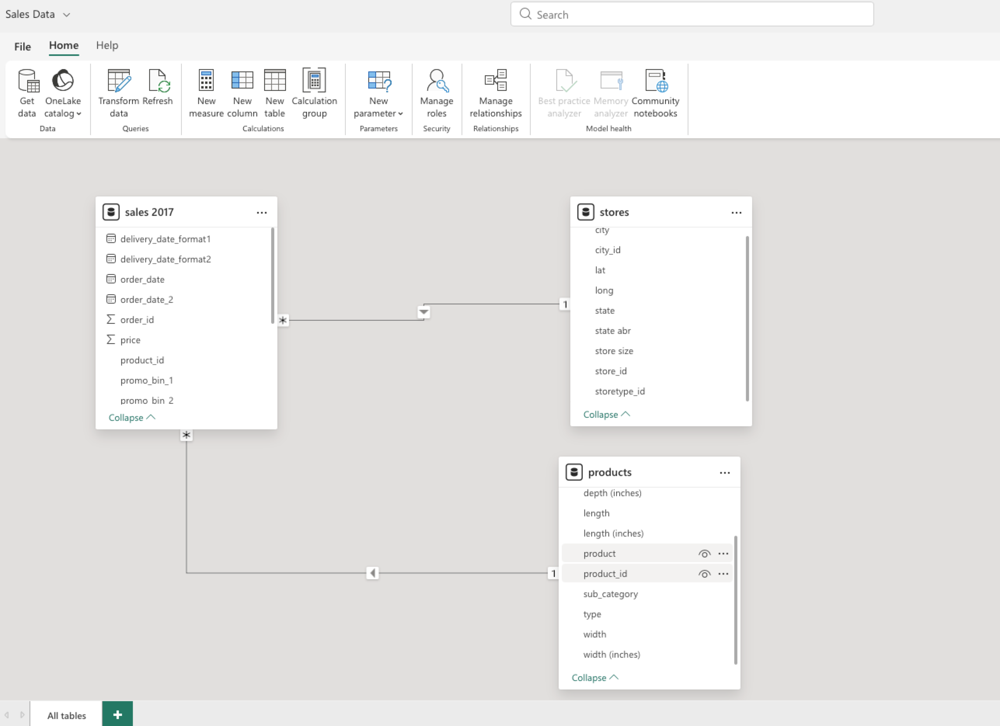

## Business Analysis and Insights 

If you want to edit or modify the datasets you can click __Transform data__ from the main menu.

Once done, and you are ready to create you report, click __File__ then select __Create new report__. This should launch a new tab, with the datasets loaded and ready for your analysis.

Let’s Create the following Dashboard:

1. Top 15 States by Revenue
   1. Stacked Column chart
   2. X-axis: `state` from `stores` table
   3. Y-axis: `revenue` with Sum as default from `sales 2017` table
   4. Filter `State` using Top N (15). Drag `revenue` to By Value field. Click, Apply filter.
   5. In the **Visualizations** pane, select **Format visual**, then **Visual** tab, then scroll to **Data labels**, and turn it on.
   6. In the **Visualizations** pane, select **Format visual**, then **General** tab, select Title, and rename to “Top 15 States by Revenue”
2. Top 15 Products by Sales
   1. Stacked Bar chart
   2. X-axis: `product` from `products` table
   3. Y-axis: `sales` with Sum as default from `sales 2017` table
   4. Filter `Product` using Top N (15). Drag `sales` to By Value field. Click, Apply filter.
   5. In the **Visualizations** pane, select **Format visual**, then **Visual** tab, then scroll to **Data labels**, and turn it on.
   6. In the **Visualizations** pane, select **Format visual**, then **General** tab, select Title, and rename to “Top 15 Products by Sales”
3. Table (city, and Average of Price)
   1. Drag `city` and `price` to the Columns of the table visualization 
   2. Change `Sum of price` to `Average of price`
   3. Change sorting to be by Average of price 

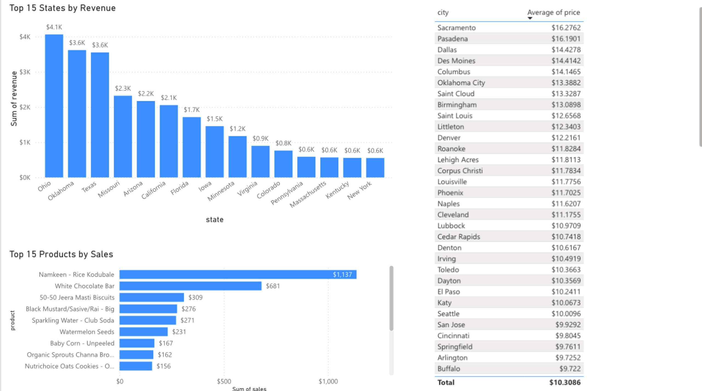

Try and find the answers the following questions:

1. **What is the total revenue in California?**
2. **How many sales has the product "Namkeen - Rice Kodubale (Sln )"?**
3. **What is the average price in Dallas?**

> [!tip]
>
> **Answers**
>
> 1. \$2,054.77
> 2. \$1137
> 3. \$14.4278

----

## Understanding Data Refresh

### Why Refresh Matters

When you upload data (like our CSV files), Power BI imports a **snapshot** of that data. If the source data changes, your reports won't automatically update—you need to refresh.

### Types of Refresh

| Refresh Type | Description |
|--------------|-------------|
| **Manual Refresh** | Click "Refresh" on a semantic model to pull latest data |
| **Scheduled Refresh** | Configure automatic refresh (up to 8x/day with Pro, 48x/day with Premium) |
| **On-Demand via API** | Trigger refresh programmatically |

### How to Set Up Scheduled Refresh (Overview)

1. In your workspace, find the semantic model
2. Click the **...** menu → **Settings**
3. Expand **Refresh** section
4. Configure schedule and credentials

> [!note]
> For CSV files uploaded directly, scheduled refresh requires storing the file in a location Power BI can access (OneDrive, SharePoint, or a gateway-connected location). We'll explore this more in later sessions.

### Refresh Status

You can monitor refresh history and status:
- Go to the semantic model → **Refresh history**
- View success/failure and duration

---

## Power Query: Additional Concepts (Reference)

While we covered the essentials today, here are additional Power Query capabilities you may explore:

### Handling Errors

When transformations fail on some rows, Power BI shows errors:

- **Error indicator**: Red text showing "Error" in cells
- **Column quality bar**: Shows percentage of errors (visible in Data profiling view)

**Common error handling techniques:**
- **Replace Errors**: Right-click column → Replace Errors → specify replacement value (e.g., `null` or `0`)
- **Remove Errors**: Right-click column → Remove Errors (deletes rows with errors)
- **Keep Errors**: Right-click column → Keep Errors (useful for investigating problematic data)

### Append Queries

Combine tables with the **same structure** (like stacking Excel sheets):
- Home menu → **Append Queries**
- Select tables to combine
- Useful for: monthly data files, regional data with same columns

### Merge Queries

Join tables on a key column (like SQL JOIN):
- Home menu → **Merge Queries**
- Select matching columns from each table
- Choose join type (Left, Right, Inner, Full, Anti)
- Useful for: enriching data with lookup tables

> [!note]
> **Merge vs Relationships**: Merge combines data in Power Query (before loading). Relationships connect tables in the data model (after loading). Both have their place—Merge for denormalizing, Relationships for star schema modeling.

### Conditional Columns

Add a column with values based on conditions:
- Add Column menu → **Conditional Column**
- Define if/then/else logic

Example: Create a "Revenue Category" column:
- If `revenue` > 100 then "High"
- Else if `revenue` > 50 then "Medium"
- Else "Low"

### Grouped Aggregations

Roll up data by categories:
- Transform menu → **Group By**
- Select grouping columns and aggregation functions

Example: Total revenue by store_id

---

Finally, click __File__, then __Save__ and name it __Sales Data Analysis__

---

## Saving and Organizing Your Work

### Where Are Things Saved?

When you save in Power BI Service, artifacts are stored in the **current workspace**. By default, this is "My workspace."

### What We Created Today

Go to your __My workspace__ and verify you have the following artifacts:

| Artifact Name | Type | Description |
|---------------|------|-------------|
| NY Property Sales | Semantic Model | Data from the NY property sales CSV |
| (Report from NY data) | Report | Basic visualizations from first exercise |
| Sales Data | Semantic Model | Cleaned data from sales2017, stores, products |
| Sales Data Analysis | Report | Dashboard with revenue and sales analysis |

### Organizing Tips

- **Rename** artifacts with clear, descriptive names
- **Favorite** important items (star icon) for quick access
- Use **Browse > Recent** to find recent work
- Move to **shared workspaces** when ready to collaborate (requires Pro license)

### Exporting Options

From any report, you can:
- **Export to PDF**: File → Export → PDF
- **Export to PowerPoint**: File → Export → PowerPoint
- **Print**: File → Print this page

---

## Day 1 Summary

Today we covered:

| Topic | Key Takeaways |
|-------|---------------|
| **Fabric Ecosystem** | Power BI is the visualization layer within Microsoft Fabric's unified analytics platform |
| **Interface** | Workspaces organize content; My workspace is personal, shared workspaces enable collaboration |
| **Semantic Models** | The data layer between raw sources and reports—centralizes business logic |
| **Power Query** | Data transformation tool: remove rows, change types, split columns, handle locale, clean text |
| **Relationships** | Connect tables through common keys to enable cross-table analysis |
| **Visualizations** | Column charts, bar charts, line charts, tables with filtering and formatting |
| **Refresh** | Data is imported as a snapshot; refresh pulls latest data |

---

## Additional Resources

- [Microsoft Learn: Power BI Documentation](https://learn.microsoft.com/en-us/power-bi/)
- [Microsoft Fabric Documentation](https://learn.microsoft.com/en-us/fabric/)
- [Power BI Community](https://community.powerbi.com/)
- [DAX Guide](https://dax.guide/) 
