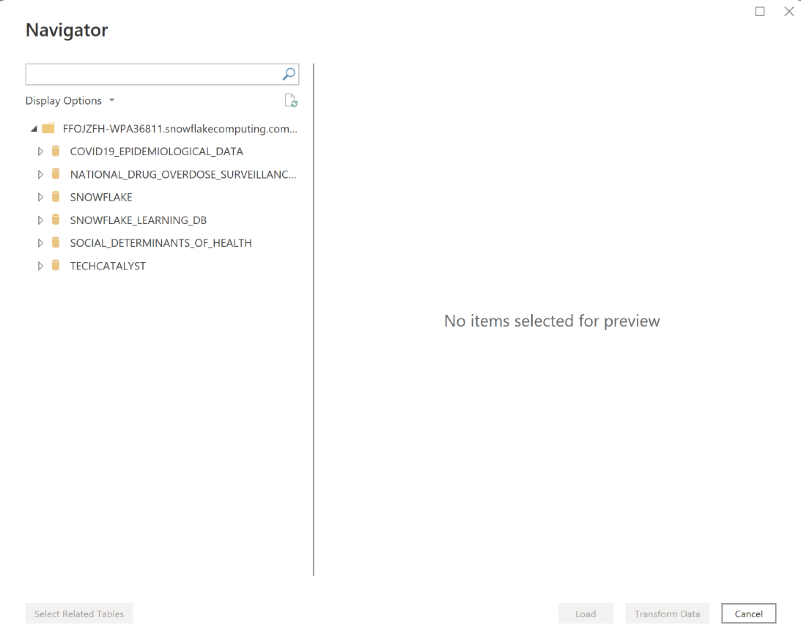
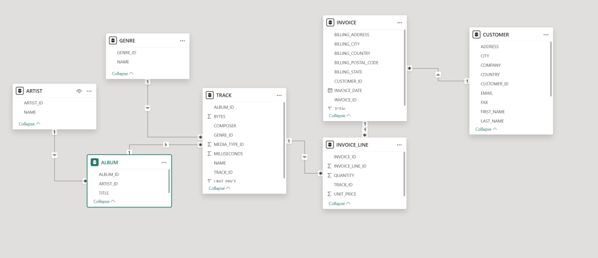
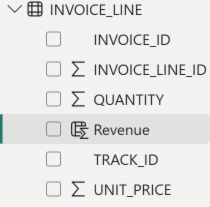
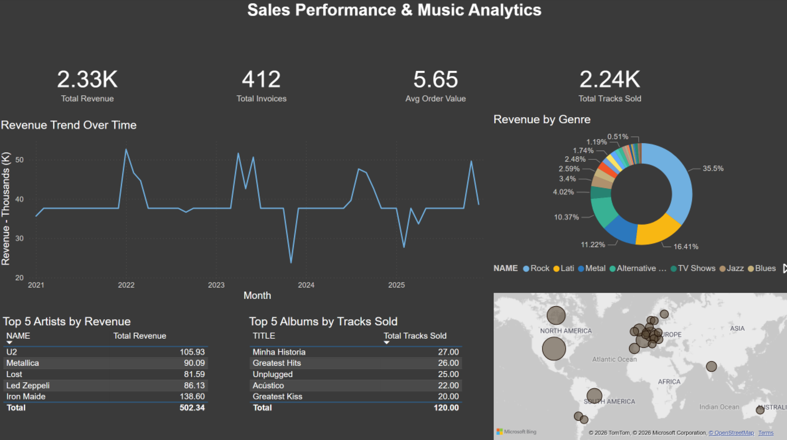
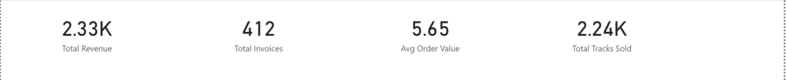
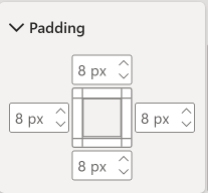
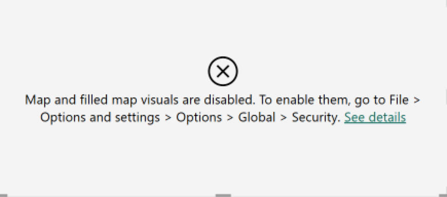
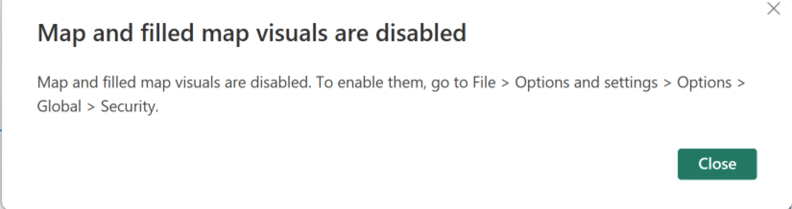
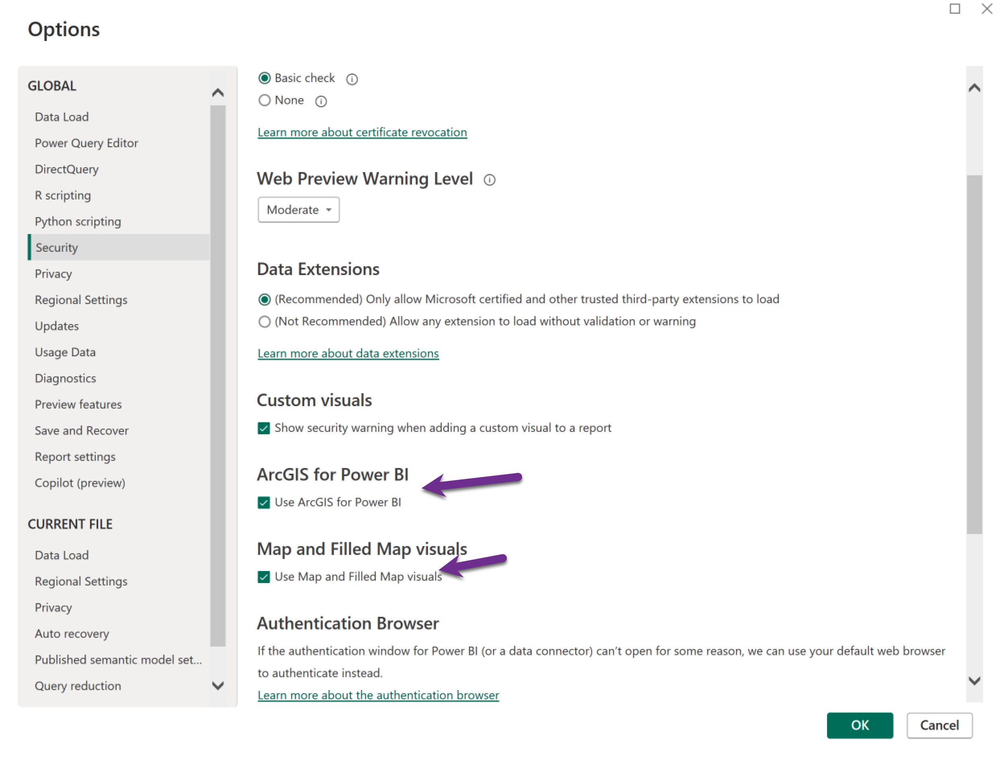

# Dashboard 1: Sales Performance & Music Analytics

[toc]

## The Scenario

You've been hired as a data analyst at **Chinook Music**, a digital music retailer that sells tracks and albums to customers worldwide through its online store. The company has been operating since 2009 and has accumulated five years of transaction data — all stored in a Snowflake cloud data warehouse.

It's Q4 planning time. The Head of Sales has scheduled a business review with the leadership team and needs a dashboard built before the meeting:

> *"We've never had a proper sales dashboard — just spreadsheets we email around. I need to see our top-line revenue numbers, understand which genres and artists are driving sales, know where our customers are coming from geographically, and understand which of our support reps is bringing in the most business. Can you put something together?"*

This is a real analytics scenario: a live cloud database, a multi-table data model, and a business stakeholder who needs answers fast. Your job is to connect to the data, build the relationships, and produce a dashboard that a non-technical executive can read in 30 seconds.

**The Chinook data model — what you're working with:**

| Table | What it contains |
|---|---|
| `INVOICE` | One row per sale: customer, date, billing country, total |
| `INVOICE_LINE` | Line items: which tracks were in each invoice, quantity, unit price |
| `TRACK` | Track catalog: name, album, genre, media type, duration, unit price |
| `ALBUM` | Album names linked to artists |
| `ARTIST` | Artist names |
| `GENRE` | Genre labels (Rock, Jazz, Classical, etc.) |
| `CUSTOMER` | Customer details: name, country, city, support rep assigned |

**Questions this data can answer:**
- What is total revenue, and how has it trended year over year?
- Which genres generate the most revenue — and which are declining?
- Who are the top-selling artists and albums?
- Which countries have the most customers and highest revenue?
- Which support rep manages the highest-value customer accounts?

**Why cloud data matters here:** Unlike Day 1's local CSV files, this data lives in Snowflake — a cloud data warehouse. This is how most enterprise analytics works. Power BI connects directly to the cloud, you choose whether to import a snapshot or query live (DirectQuery), and the data model you build reflects the real relational structure of the business.

---

## Activity Overview

In this activity, you'll build a complete sales dashboard using the Chinook database. You'll connect to Snowflake, build a star schema data model, and create KPI cards, charts, and tables to answer the Head of Sales' questions.

**What you'll create:**

- 4 KPI summary cards (revenue, customers, tracks sold, average order value)
- Revenue trend line chart
- Genre distribution donut chart
- Top artists and albums tables
- Geographic customer map

------

## Step 1: Connect to Snowflake and Load Data

1. **Open Power BI Desktop**

2. **Get Data**:

   - Click **Home** tab → **Get Data** → **More**
   - Search for "Snowflake" and select **Snowflake**
   - Click **Connect**

3. **Enter Connection Details**:

   - Server: `[your-snowflake-account].snowflakecomputing.com`
   - Warehouse: `COMPUTER_WH`
   - Click **OK**

4. **Authenticate**:

   - Enter your Snowflake username and password
   - Click **Connect**

5. **Select Tables**:

   The navigator screen will show.

   

   * In the Navigator window, expand your database and schema
     * Expand the __TECHCATALYST__ Database. Then expand the __CHINOOK__ schema.

   - Check the boxes for these 7 tables:
     - ✅ `INVOICE`
     - ✅ `INVOICE_LINE`
     - ✅ `TRACK`
     - ✅ `ALBUM`
     - ✅ `ARTIST`
     - ✅ `GENRE`
     - ✅ `CUSTOMER`
   - Click **Import** (not Transform Data - we'll clean later if needed) then __OK__

6. **Wait for data to load** (you'll see progress in bottom-right corner)

> [!tip] 
>
> If tables don't appear, make sure you're looking in the correct Schema. Snowflake uses DATABASE → SCHEMA → TABLE hierarchy.

> [!note]
>
> __Import vs DirectyQuery__
>
> - **Where data lives**
>   - **Import**: Data is copied and stored inside the PBIX/Power BI dataset.
>   - **DirectQuery**: Data stays in SQL/warehouse/etc.; visuals send queries back to the source.
> - **Performance**
>   - **Import**: Generally faster, uses VertiPaq, great for interactive slicing across small–medium data.
>   - **DirectQuery**: Typically slower and depends on source DB and network latency.
> - **Freshness**
>   - **Import**: Data only updates on scheduled/ manual refresh.

------

## Step 2: Create Relationships in Model View

> [!tip]
>
> If you want to learn about the Chinook data model you can view it here https://github.com/lerocha/chinook-database 

1. Click **Model View** icon (left sidebar, bottom icon). __Note that Power BI will attempt to do this for you__. Make sure you confirm the results. 

2. **Arrange your tables** - drag them to organize like this:

   - Center: `INVOICE` and `INVOICE_LINE` (fact tables)
   - Around the edges: other tables (dimension tables)

3. **Create the following relationships** (drag from one column to another):

   - `INVOICE[CUSTOMER_ID]` → `CUSTOMER[CUSTOMER_ID]`

   - `INVOICE_LINE[INVOICE_ID]` → `INVOICE[INVOICE_ID]`

   - `INVOICE_LINE[TRACK_ID]` → `TRACK[TRACK_ID]`

   - `TRACK[ALBUM_ID]` → `ALBUM[ALBUM_ID]`

   - `TRACK[GENRE_ID]` → `GENRE[GENRE_ID]`

   - `ALBUM[ARTIST_ID]` → `ARTIST[ARTIST_ID]`

     

4. **Verify relationships** - each line should show "1" on one side and "*" on the other

5. Click **Report View** to return to canvas

> [!note]
>
> Power BI should auto-detect most relationships. If a relationship already exists, you'll see the line connecting the tables.

------

## Step 3: Create Calculated Columns and Measures

Before building visuals, we need to create some calculations.

### Create Revenue Calculated Column

1. Click on `INVOICE_LINE` table in the **Data** pane

2. **Modeling** tab → **New Column**

3. In the formula bar, type:

   ```DAX
   Revenue = INVOICE_LINE[UNIT_PRICE] * INVOICE_LINE[QUANTITY]
   ```

4. Press **Enter**

Confirm `Revenue` is created 



### Create Key Measures

1. **Create Total Revenue Measure**:

   - Right-click on `INVOICE_LINE` table → **New Measure**

   - Type:

     ```DAX
     Total Revenue = SUM(INVOICE_LINE[Revenue])
     ```

2. **Create Total Invoices Measure**:

   - Right-click on `INVOICE` table → **New Measure**

   - Type:

     ```DAX
     Total Invoices = COUNTROWS(INVOICE)
     ```

3. **Create Average Order Value Measure**:

   - Right-click on `INVOICE` table → **New Measure**

   - Type:

     ```DAX
     Avg Order Value = DIVIDE([Total Revenue], [Total Invoices])
     ```

4. **Create Total Tracks Sold Measure**:

   - Right-click on `INVOICE_LINE` table → **New Measure**

   - Type:

     ```DAX
     Total Tracks Sold = SUM(INVOICE_LINE[QUANTITY])
     ```

> [!important]
>
> Measures (with Σ icon) are different from columns. Measures calculate dynamically based on context; columns are computed row-by-row.

------

## Step 4: Create KPI Cards



We'll create 4 KPI cards across the top of the dashboard.

### KPI Card 1: Total Revenue

1. Click blank area on canvas
2. Select **Card** visual from Visualizations pane
3. Add field:
   - Drag `Total Revenue` measure → **Fields** well
4. Resize and position in top-left corner
5. **Format the card**:
   - Select the card
   - Click **Format visual** 
   - **Callout value**:
     - Display units: **Thousands (K)** 
     - Font size: **28**
   - **Category label**:
     - Text:  It is On to display "Total Revenue"
     - Font size: **10**

### KPI Card 2: Total Invoices

1. Click blank area
2. Select **Card** visual
3. Drag `Total Invoices` measure → **Fields**
4. Position next to the first card
5. Format similarly (change label to "Total Invoices")

### KPI Card 3: Average Order Value

1. Click blank area
2. Select **Card** visual
3. Drag `Avg Order Value` measure → **Fields**
4. Position next to second card
5. Format similarly (label: "Avg Order Value")

### KPI Card 4: Total Tracks Sold

1. Click blank area
2. Select **Card** visual
3. Drag `Total Tracks Sold` measure → **Fields**
4. Position next to third card
5. Format similarly (label: "Total Tracks Sold")

> [!tip]
>
> Select all 4 cards (Ctrl+Click), then Format → Align → Align Top to make them uniform.



------

## Step 5: Create Revenue Trend Line Chart

1. Click blank area below the KPI cards
2. Select **Line Chart** from Visualizations pane
3. Add fields:
   - `INVOICE[INVOICE_DATE]` → **X-axis**
   - `Total Revenue` measure → **Y-axis**
   - Click the dropdown on `INVOICE_DATE` in X-axis well
   - Select **Date Hierarchy** → Expand to **Month**
4. Resize to take up about 60% width of the canvas
5. **Format the chart**:
   - **Title**:
     - Title text: "Revenue Trend Over Time"
     - Font size: **14**
   - **X-axis**:
     - Title: "Month"
   - **Y-axis**:
     - Title: “Revenue - Thousands (K)”
   - **Lines**:
     - Stroke width: **2**

------

## Step 6: Create Revenue by Genre Donut Chart

1. Click blank area (to the right of line chart)
2. Select **Donut Chart** from Visualizations pane
3. Add fields:
   - `GENRE[NAME]` → **Legend**
   - `Total Revenue` measure → **Values**
4. Position next to the line chart (remaining 40% width)
5. **Format the chart**:
   - **Title**: "Revenue by Genre"
   - **Legend**: Position **Bottom Center**
   - **Detail labels**: Turn **On** (shows percentages)

------

## Step 7: Create Top 5 Artists Table

1. Click blank area below the charts

2. Select **Table** visual from Visualizations pane

3. Add fields:

   - `ARTIST[NAME]` → **Columns**
   - `Total Revenue` measure → **Columns**

4. **Add Top N Filter**:

   - Select the table
   - In **Filters** pane, find `NAME` under "Filters on this visual"
   - Change filter type to **Top N**
   - Set to show **Top 5**
   - By value: drag `Total Revenue` measure
   - Click **Apply filter**

5. Resize to take up about 1/3 width of row

6. **Format the table**:

   - **Title**: "Top 5 Artists by Revenue"

   - **Style**: **Minimal**

   - **Grid**:

     - padding: **8**

       

------

## Step 8: Create Top 5 Albums Table

1. Click blank area next to artists table
2. Select **Table** visual
3. Add fields:
   - `ALBUM[TITLE]` → **Columns**
   - `Total Tracks Sold` measure → **Columns**
4. **Add Top N Filter**:
   - Filter `TITLE` to **Top 5**
   - By value: `Total Tracks Sold`
   - Apply filter
5. Resize to take up about 1/3 width
6. **Format the table**:
   - **Title**: "Top 5 Albums by Tracks Sold"
   - Format similarly to artists table

------

## Step 9: Create Sales by Country Map

1. Click blank area next to albums table

2. Select **Map** visual (or **Filled Map**) from Visualizations pane

   

   If you click See Details you will get 

   

   Follow the steps 

   

   **Sometimes you will need to close the application and re-open for it to take effect. Make sure to save your work first.** 

3. Add fields:

   - `CUSTOMER[COUNTRY]` → **Location**
   - `Total Revenue` measure → **Bubble Size** (for Map) or **Color saturation** (for Filled Map)

4. Resize to remaining 1/3 width

5. **Format the map**:

   - **Title**: "Sales by Country"
   - **Data colors**: Choose a color gradient
   - **Zoom buttons**: Turn **On**

> [!note]
>
> If countries don't appear correctly, Power BI may need to geocode them. Click the warning icon and select "Yes, use as geographic data."

------

## Step 10: Final Formatting and Polish

1. **Add a report title**:
   - **Insert** tab → **Text box**
   - Type: "Sales Performance & Music Analytics"
   - Format: Font size **20**, Bold, Center align
   - Position at very top of page
2. **Apply consistent colors**:
   - From View select a theme.
3. **Test interactions**:
   - Click on different segments in the donut chart
   - Verify all visuals filter appropriately

------

## Step 11: Save Your Work

1. **File** → **Save As**
2. Name: `Chinook_Sales_Dashboard.pbix`
3. Click **Save**

------

## Expected Results

When complete, your dashboard should show:

- 4 KPI cards at the top showing totals
- A line chart showing revenue trends by month
- A donut chart showing revenue distribution by genre
- A table of top 5 artists by revenue
- A table of top 5 albums by tracks sold
- A geographic map showing sales by country

**Total visuals**: 9 (4 cards + 5 charts/tables)

------

## Common Issues and Solutions

### Issue: Relationships Won't Create

**Solution**: Make sure column data types match. Both columns must be INT or both must be TEXT. Check in Table View.

### Issue: Measures Show Wrong Totals

**Solution**: Don't use calculated columns in measures. Use `SUM(INVOICE_LINE[Revenue])` not `SUM(Revenue)` without table name.

### Issue: Map Doesn't Show Countries

**Solution**: Click the warning icon on the visual and confirm you want Power BI to use the field as geographic data.

### Issue: Dates Don't Sort Correctly

**Solution**: Make sure INVOICE_DATE is recognized as Date type. Check in Model View → Column properties.

### Issue: Visuals Are Blank

**Solution**: Check filters pane. You may have accidentally filtered out all data. Clear filters and try again.

------

## Bonus Challenges

If you finish early, try these enhancements:

1. **Add a slicer** for Genre - let users filter the entire dashboard by music genre
2. **Create a second page** showing customer analytics (most valuable customers, customers by country)
3. **Add conditional formatting** to the Top 5 tables - highlight the #1 artist/album
4. **Create a YTD (Year-to-Date) revenue measure** using DAX time intelligence
5. **Add drill-through** from the map to a detail page showing individual customer purchases

------

## Extension: Drill-Through Pages

**Estimated time:** 15 minutes
**Prerequisite:** Dashboard 1 complete

Drill-through lets users right-click any data point in a visual and navigate to a detail page filtered to that specific context. It's one of the most practical navigation features in Power BI and something your report users will expect.

In this extension you'll build a **Country Detail** drill-through page: right-click any country on the geographic map → land on a page showing every invoice from that country.

---

### Step 1: Add a new report page

1. At the bottom of the screen, click the **+** icon next to the page tabs
2. Double-click the new tab and rename it: `Country Detail`

---

### Step 2: Set the drill-through field

This is the key step — it tells Power BI which field triggers the drill-through.

1. Make sure you're on the `Country Detail` page
2. In the **Visualizations** pane, look for the **Drill through** section (at the bottom of the pane, below Filters)
3. Drag `CUSTOMER[COUNTRY]` into the **Add drill-through fields here** well

> **What you should see:** Power BI automatically adds a **Back** button to the page (top-left corner). This is the button users click to return to the previous page after drilling through. Don't delete it.

---

### Step 3: Build the detail visuals on this page

Now add visuals that make sense for "I want to see everything about a specific country":

**Visual 1 — Country KPI card**

1. Add a **Card** visual
2. Drag `CUSTOMER[COUNTRY]` → Fields
3. This shows which country was drilled into
4. Format: large font, place at the top of the page

**Visual 2 — Invoice detail table**

1. Add a **Table** visual
2. Add these columns:
   - `CUSTOMER[Full Name]` → Columns
   - `INVOICE[INVOICE_DATE]` → Columns
   - `INVOICE[TOTAL]` → Columns
3. Sort by `INVOICE_DATE` descending (most recent first)
4. Title: `All Invoices`

**Visual 3 — Revenue by customer (bar chart)**

1. Add a **Clustered Bar Chart**
2. Fields:
   - `CUSTOMER[Full Name]` → Y-axis
   - `Total Revenue` measure → X-axis
3. Title: `Revenue by Customer`

**Visual 4 — Revenue over time (line chart)**

1. Add a **Line Chart**
2. Fields:
   - `INVOICE[INVOICE_DATE]` → X-axis
   - `Total Revenue` → Y-axis
3. Title: `Revenue Over Time`

---

### Step 4: Test the drill-through

1. Click the **Page 1** tab (your main Dashboard 1 page)
2. Find the **geographic map** visual — click on any country to select it (e.g., USA)
3. **Right-click** the highlighted country on the map
4. In the context menu, select **Drill through → Country Detail**

> **What you should see:** Power BI navigates to the `Country Detail` page. All 4 visuals are now filtered to show only data from that country. The invoice table shows only invoices from customers in that country. The **Back** button in the top-left returns you to the map page.

> **If "Drill through" doesn't appear in the right-click menu:** The drill-through field wasn't set correctly. Go back to the `Country Detail` page → check that `CUSTOMER[COUNTRY]` is in the Drill through well (not in the Filters well).

---

### Why drill-through is powerful

Without drill-through, a user who sees an interesting country on the map has no way to dig deeper — they'd have to manually set a filter. Drill-through makes the report self-navigating: the summary page is the entry point, detail pages answer "tell me more about this specific thing".

**Common drill-through patterns in real dashboards:**
- Summary map → Country detail
- Top 10 customers table → Individual customer purchase history
- Genre donut chart → All tracks in that genre
- Monthly revenue line → All invoices in that month

---

## What You Learned

✅ How to connect Power BI to Snowflake
✅ Creating star schema relationships in Model View
✅ Building DAX measures for aggregations
✅ Creating KPI cards for dashboard summaries
✅ Using Top N filters on visuals
✅ Formatting and polishing a professional dashboard
✅ Building drill-through pages for contextual navigation

------