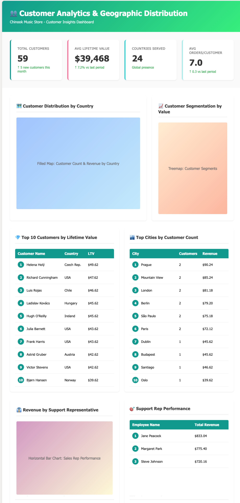

# Lab 

The challenge is for you to create a dashboard in Power BI based on a mockup design:

**What you'll create:**

- 4 KPI summary cards
- Customer distribution map
- Customer segmentation treemap
- Top 10 customers by lifetime value
- Top cities by customer count
- Support representative performance visuals

**Select Tables**:

- In the Navigator window, expand your database and schema
- Check the boxes for these 4 tables:
  - ✅ `CUSTOMER`
  - ✅ `INVOICE`
  - ✅ `INVOICE_LINE`
  - ✅ `EMPLOYEE`

